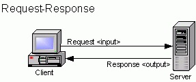
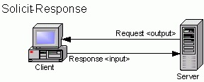
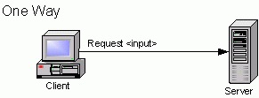
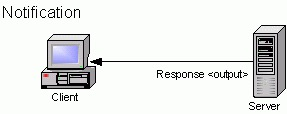

# 潘多拉魔盒：异步

>  敕勒川，阴山下。天似穹庐，笼盖四野。天苍苍，野茫茫，风吹草低见牛羊。 ——南北《敕勒歌》

* 项目地址：<https://github.com/silentbalanceyh/vertx-zero-example/>（子项目：**up-rhea**）

##  「壹」异步原理

&ensp;&ensp;&ensp;&ensp;到目前为止，所有的代码示例都是**同步（Sync）**的，代码并没有真正释放Zero框架和Vert.x的魔力，本章节就是彻底地放飞，把这个**潘多拉**魔盒打开。在Vert.x中，我们通常会把一份数据、一个包含数据的请求统称为Event（事件），所以本章将会讲解Zero中最核心的内容——事件驱动模型（Event Drivent Model）。

### 1.1. 风格综述

&ensp;&ensp;&ensp;&ensp;在网络消息交互模式中，通常会有下边四种（参考WSDL规范）：

* Request-Response：请求/响应模式。
    
* Solicit-Response：发布/订阅模式。
    
* One-Way：单向请求模式。
    
* Notification：提醒模式。
    

>  图片引用地址：<https://help.perforce.com/hydraexpress/4.3.0/html/rwsfexpwsfabricationug/9-2.html>

&ensp;&ensp;&ensp;&ensp;Zero中针对上述四种模式分成了四种类型：

|名称|模式|使用场景|
|---|---|:---|
|标准流|Request-Response|「高频」通常使用的RESTful API。|
|单向流|One-Way|不关心任何请求结果的RESTful API。|
|检测流|One-Way|检测远程服务器是否合法（通常仅发送Header请求）。|

> 由于Solicit-Response模式和Notification模式都是服务端主动触发，这两种模式目前Zero的版本还不支持（和作者接触的项目需求有关）。

&ensp;&ensp;&ensp;&ensp;Zero中对编程风格的划分主要基于三个维度：

1. Java语言：是interface类还是class类。
2. Vert.x工具集：是否启用EventBus。
3. WSDL规范：是否关心响应。

&ensp;&ensp;&ensp;&ensp;本章之后章节会讲解**八种风格**中Zero推荐和高频使用的编程风格。

### 1.2. Zero模式

&ensp;&ensp;&ensp;&ensp;Vert.x中的Verticle组件主要分为两种类型：EventLoop和Worker，根据这两类组件的特征，最终Zero对组件职责进行了重新定义：

|线程类型|组件名|Lambda组件|含义/职责|
|---|:---|:---|:---|
|EventLoop|Agent组件|发送者Sender|接收请求、同步执行、发送异步请求到EventBus|
|Worker|Worker组件|消费者Consumer|消费EventBus请求、异步执行、生成响应|

&ensp;&ensp;&ensp;&ensp;Zero最终支持五种核心的请求模式。

#### 1.2.1. Sync - 同步模式

**流程图**


**代码**

```java
    @GET
    @Path("/sync")
    public String doSync(
            @QueryParam("name") final String name
    ) {
        return "Hi + " + name;
    }
```

**限制规则**

* 方法定义的返回类型（return）**不能是**`void`。
* 不使用`@Address`注解（Zero专用注解`io.vertx.up.annotations.Address`）。

#### 1.2.2. Ping - 信号模式

**流程图**


**代码**

```java
    @GET
    @Path("/ping/{name}")
    public void doPing(
            @PathParam("name") final String name) {
        System.out.println("Ping Request");
    }
```

**限制规则**

* 方法定义的返回类型（return）**必须是**`void`。
* 该方法只会收到类似`true/false`的响应信息，并不会得到任何和**代码逻辑**相关的响应数据。

#### 1.2.3. OneWay - 单向模式

**流程图**


**代码：Sender发送者**

```java
    @POST
    @Path("/one-way")
    @Address("ZERO://ONE-WAY")
    public String sendOneWay(
            @BodyParam final JsonObject json) {
        return json.encode();
    }
```

**代码：Consumer消费者**

```java
    @Address("ZERO://ONE-WAY")
    public void reply(final Envelop message) {
        final JsonObject data = Ux.getJson(message);
        // Do somethings
        System.out.println(data.encodePrettily());
    }
```

**限制规则**

* 该模式中使用了Zero的三个核心注解：
    * Agent组件：`io.vertx.up.annotations.EndPoint`。
    * Worker组件：`io.vertx.up.annotations.Queue`。
    * EventBus地址：`io.vertx.up.annotations.Address`。
* EndPoint注解的Agent组件方法不能使用`void`的返回值。
* Worker签名必须符合Zero中的Worker方法签名规范，并且返回值**必须是**`void`。

#### 1.2.4. Standard - 标准模式

**流程图**


**代码：Sender发送者**

```java
    @POST
    @Path("/async")
    @Address("ZERO://ASYNC")
    public String sendAsync(
            @BodyParam final JsonObject json) {
        return json.encode();
    }
```

**代码：Consumer消费者**

```java
    @Address("ZERO://ASYNC")
    public Envelop replyAsync(final Envelop message) {
        final JsonObject data = Ux.getJson(message);
        // Do somethings
        return Envelop.success(data);
    }
```

**限制规则**

* 该模式中使用了Zero的三个核心注解：
    * Agent组件：`io.vertx.up.annotations.EndPoint`。
    * Worker组件：`io.vertx.up.annotations.Queue`。
    * EventBus地址：`io.vertx.up.annotations.Address`。
* EndPoint注解的Agent组件方法不能使用`void`的返回值。
* Worker签名必须符合Zero中的Worker方法签名规范，并且返回值**不能是**`void`。

#### 1.2.5. Callback - 回调模式

**流程图**


**代码：Sender发送者**

```java
    @Path("/callback")
    @POST
    @Address("ZERO://CALLBACK")
    public JsonObject sayCallback(
            @BodyParam final JsonObject data) {
        return data;
    }
```

**代码：Consumer消费者**

```java
    @Address("ZERO://CALLBACK")
    public void replyCallback(final Message<Envelop> message) {
        message.reply(Envelop.success("Callback Success"));
    }
```

**限制规则**

* 该模式中使用了Zero的三个核心注解：
    * Agent组件：`io.vertx.up.annotations.EndPoint`。
    * Worker组件：`io.vertx.up.annotations.Queue`。
    * EventBus地址：`io.vertx.up.annotations.Address`。
* EndPoint注解的Agent组件方法不能使用`void`的返回值。
* Worker签名是固定签名规范，返回值**必须是**`void`。

> 完整代码可下载代码后，参考up-rhea项目。

##  「贰」统一模型

&ensp;&ensp;&ensp;&ensp;上述原理解析过程中，图解和代码十分容易理解，略微复杂的是Zero中定义的**统一数据模型**：`io.vertx.up.commune.Envelop`，该模型充斥在整个Zero环境中，并且可直接在EventBus中传输（重写过Codec），于是它的数据结构就值得我们细细分析。

&ensp;&ensp;&ensp;&ensp;该数据模型融合了

##  「叄」Worker函数签名
