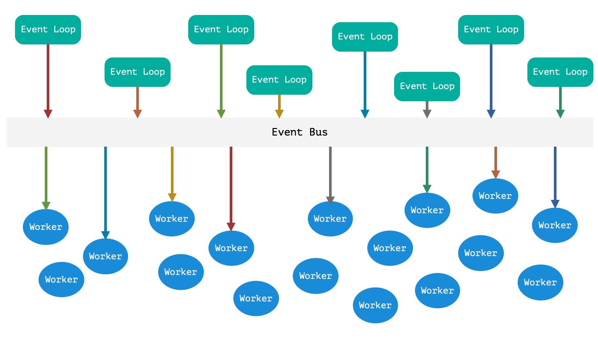
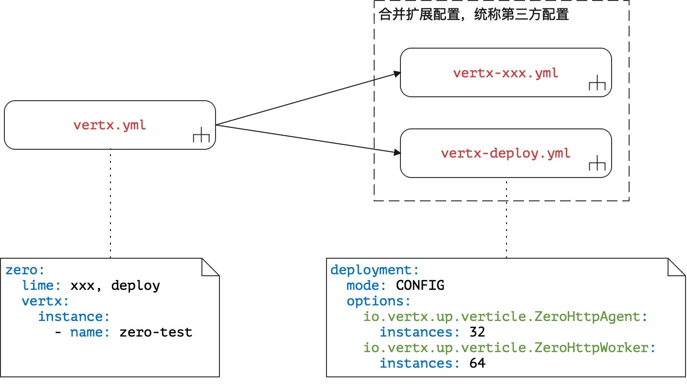

# 铁马冰河：细谈Worker

>  操吴戈兮被犀甲，车错毂兮短兵接。——屈原《九歌·国殇》

* 项目地址：<https://github.com/silentbalanceyh/vertx-zero-example/>（子项目：**up-rhea**）

##  「壹」函数签名

&ensp;&ensp;&ensp;&ensp;前边所有的章节都在告诉读者如何使用JSR311和JSR303书写一个Agent组件，虽然部分代码中包含了Worker组件的写法，但并未细讲Worker，本章节通过更多的示例告诉读者如何书写Zero中的Worker组件。一旦使用Worker组件则意味着您将启用EventBus并使用异步数据流，为了照顾大部分您，所以在Zero中支持三种风格的Worker编程，您可以读完本章后自行选择。

### 1.1. 开发步骤

&ensp;&ensp;&ensp;&ensp;前文中提到了Agent组件的常规代码，通常如下：

```java
package cn.vertxup.worker;

import io.vertx.core.json.JsonObject;
import io.vertx.up.annotations.EndPoint;

import javax.ws.rs.BodyParam;
import javax.ws.rs.POST;
import javax.ws.rs.Path;

@EndPoint
@Path("/hi/worker")
public class ModeAgent {
    @POST
    @Path("/standard")
    public String hiWorker(@BodyParam final JsonObject json) {
        return json.encode();
    }
}
```

&ensp;&ensp;&ensp;&ensp;直接发送请求会收到类似如下响应：

```json
{
    "data": "{\"username\":\"Lang\"}"
}
```

&ensp;&ensp;&ensp;&ensp;接下来稍做改动：

```java
// 增加@Address的导入
import io.vertx.up.annotations.Address;
// 直接将方法代码改成如下：
    @POST
    @Path("/standard")
    @Address("ZERO://WORKER/STANDARD")
    public String hiWorker(@BodyParam final JsonObject json) {
        return json.encode();
    }
```

&ensp;&ensp;&ensp;&ensp;这种情况直接启动会看到如下输出：

```shell
io.vertx.zero.exception.WorkerMissingException: [ERR-40014] (EventDiffer) \
ZeroException occurs: Zero detected that there is no method of @Queue \
annotated @Address = ZERO://WORKER/STANDARD, the worker missing.
```

&ensp;&ensp;&ensp;&ensp;上述输出明确告诉了开发者：您启用了Worker组件但对定义的`ZERO://WORKER/STANDARD`地址并没有找到和它对应的**Worker组件**，然后针对这个地址添加新代码。

```java
package cn.vertxup.worker;

import io.vertx.up.annotations.Address;
import io.vertx.up.annotations.Queue;
import io.vertx.up.commune.Envelop;
import io.vertx.up.unity.Ux;

@Queue
public class ModeActor {
    @Address("ZERO://WORKER/STANDARD")
    public void hiWorker(final Envelop envelop) {
        final String strData = Ux.getString(envelop);
        System.out.println(strData);
    }
}
```

&ensp;&ensp;&ensp;&ensp;再发送请求就得到下边响应：

```json
{
    "data": true
}
```

&ensp;&ensp;&ensp;&ensp;这样一个Agent/Worker组件就完全开发好了，总结一下引入Worker的开发步骤：

1. 创建一个Java类，可以是class也可以是interface（本章后续章节会讲解），该类使用`@EndPoint`注解。
2. 书写该类中的方法，并对该类使用JSR311中的注解定义RESTful相关元素。
3. 使用`@Address`注解并设置常量字符串定义EventBus通讯地址。
4. 书写Worker类，并使用`@Queue`和`@Address`注解定义Worker的代码执行逻辑。

### 1.2. 部署配置

&ensp;&ensp;&ensp;&ensp;继续看Agent/Worker代码之前先来关注一下基本配置信息，一旦在Zero中部署了所有的Worker和Agent过后，整个线程池就形成了下图这种结构（为了突出异步操作，数据流用了彩色）：



&ensp;&ensp;&ensp;&ensp;从上图可以知道，Agent实例和Worker实例的数量是不对等的，而本小节将介绍的就是如何在环境中设置部署数量，Zero中执行该部署的配置文件结构如下：



&ensp;&ensp;&ensp;&ensp;右边的`deployment`节点控制了Agent和Worker的线程数量，一般情况二者比例使用`1:2`，这个也可以在不同生产环境中进行微调；除了上图演示的`instances`属性以外，该节点还包含了其他的属性信息，对应到DeploymentOptions类中。

##  「贰」三足鼎立

&ensp;&ensp;&ensp;&ensp;Zero对Worker组件的方法签名进行了详细设计，本章就一一讲解签名的三种核心类型：

1. 同步入参和返回值。
2. Handler模式（`io.vertx.core.eventbus.Message`入参，void返回值）。
3. 异步入参和返回值（`io.vertx.core.Future`模式）。

&ensp;&ensp;&ensp;&ensp;还有一点您可以放心，不论使用哪种类型的Worker方法签名，数据流都是**异步**的，而您也不用担心您的同步代码如何**异步化**，这些操作Zero系统会自动完成。

> 后续示例中定义的API根路径都为`/hi/worker`，代码段中只演示核心代码段，完整代码参考`up-rhea`。

### 2.1. 同步模式

#### 2.1.1. 基本形态

&ensp;&ensp;&ensp;&ensp;接下来先看一个示例：

**Agent代码段**

```java
    @GET
    @Path("/sync-one")
    @Address("ZERO://WORKER/SYNC/ONE-WAY")
    public String hiOneWay(@QueryParam("name") final String name) {
        return name;
    }
```

**Worker代码段**

```java
    @Address("ZERO://WORKER/SYNC/ONE-WAY")
    public void hiOneWay(final Envelop envelop) {
        final String strData = Ux.getString(envelop);
        System.out.println(strData);
    }
```

&ensp;&ensp;&ensp;&ensp;发送GET请求到`/hi/worker/sync-one?name=lang.yu`，您将得到如下响应结果：

```json
{
    "data": true
}
```

&ensp;&ensp;&ensp;&ensp;说明点：

1. 如果Worker中的方法返回值为void，且参数为普通类，则模式自动转换成OneWay模式。
2. 如果代码执行没有异常信息，则返回true，否则返回false。
3. Worker的参数限制：长度必须是1，并且参数类型必须是`io.vertx.up.commune.Envelop`。
4. **特别注意**：这种模式中Agent方法的返回值和Envelop中读取数据的API必须匹配。

    ```java
    // Agent中返回 java.lang.String
    public String hiOneWay(...)
    // Worker中提取数据使用下边代码段
    final String strData = Ux.getString(envelop);
    ```

&ensp;&ensp;&ensp;&ensp;如果修改上述代码中Worker代码如：

```java
    public Envelop hiOneWay(final Envelop envelop) {
        final String strData = Ux.getString(envelop);
        return Envelop.success(new JsonObject().put("input", strData));
    }
```

&ensp;&ensp;&ensp;&ensp;响应信息会变成：

```json
{
    "data": {
        "input": "lang.yu"
    }
}
```

#### 2.1.2. 返回值偏态（扩展一）

**Agent代码段**

```java
    @GET
    @Path("/sync-adjust")
    @Address("ZERO://WORKER/SYNC/ONE-ADJUST")
    public String hiAdjust(@QueryParam("name") final String name) {
        return name;
    }
```

**Worker代码段**

```java
    @Address("ZERO://WORKER/SYNC/ONE-ADJUST")
    public JsonObject hiAdjust(final Envelop envelop) {
        final String strData = Ux.getString(envelop);
        return new JsonObject().put("input", strData);
    }
```

&ensp;&ensp;&ensp;&ensp;这种模式下可更换返回值类型为基本Java类型，这样操作的话Zero会自动调用`Envelop.success`对返回数据进行封装，如此操作就增大了同步模式的自由度，但有一点，如果想要返回一个**错误的信封**，那么还是推荐返回值使用Envelop，因为它会包含两种形态：成功与失败。

#### 2.1.3. 入参偏态（扩展二）

**Agent代码段**

```java
    @GET
    @Path("/sync-adjust2")
    @Address("ZERO://WORKER/SYNC/ONE-ADJUST2")
    public String hiAdjust2(@QueryParam("name") final String name) {
        return name;
    }
```

**Worker代码段**

```java
    @Address("ZERO://WORKER/SYNC/ONE-ADJUST2")
    public Envelop hiAdjust2(final String name) {
        return Envelop.success(new JsonObject().put("input", name));
    }
```

&ensp;&ensp;&ensp;&ensp;这种模式也是同步下的一把利刃，主要原因是返回值有两种状态，打破了方法返回值的唯一性，更符合常规情况下RESTful代码的执行过程，并且更符合常规开发习惯。

#### 2.1.4. 自由态（扩展三）

**Agent代码段**

```java
    @GET
    @Path("/sync-adjust1")
    @Address("ZERO://WORKER/SYNC/ONE-ADJUST1")
    public String hiAdjust1(@QueryParam("name") final String name) {
        return name;
    }
```

**Worker代码段**

```java
    @Address("ZERO://WORKER/SYNC/ONE-ADJUST1")
    public JsonObject hiAdjust1(final String name) {
        return new JsonObject().put("input", name);
    }
```

&ensp;&ensp;&ensp;&ensp;相信这种模式是**您**最喜欢的模式，因为它是**自由的**，您可以书写任意方法来完成Worker组件的代码逻辑，唯一的限制就是参数只有一个——不用我多说，因为Worker组件拿到的参数就是Agent组件的返回值，由于返回值只有一个，所以第一参数必须是类型匹配的。

#### 2.1.5. 同步汇总

|返回类型|参数类型|形态名|
|---|---|:---|
|void/Void|Envelop|标准形态One-Way|
|void/Void|T|入参偏态One-Way|
|Envelop|Envelop|标配形态|
|T|Envelop|返回偏态|
|Envelop|T|入参偏态|
|T|T|自由态|

&ensp;&ensp;&ensp;&ensp;T表示Java语言中的自由数据类型。此处再讨论想何时使用Envelop数据类型：

1. 入参使用Envelop类型：一般除开Agent发送给Worker的数据以外，若您需要在更复杂的应用环境中使用一些额外数据（一般是Vertx中的原生对象如Session，User等），同时您而又不想扩展Worker的函数签名则可以使用Envelop类型作为入参。
2. 返回使用Envelop类型：一般出现异常情况时，您可以直接将定义好的WebException抛出而不用关心错误产生时的业务逻辑，但是总会出现一种情况是您需要在异常发生时去执行某些代码逻辑的，这种情况下您就可以使用Envelop类型构造**双态**返回值。

&ensp;&ensp;&ensp;&ensp;所以，虽然自由态非常好用，但往往在实际场景中可能会面临复杂情况，如何选择同步模式则根据您自己的实际需求而定，从我在前三个Zero项目中的经历看，**同步模式**一般很少用，大部分场景中都使用了后边提到的**异步模式**，若是异步模式则Envelop类型的使用就只需考虑**入参**一种情况，返回值会直接被`io.vertx.core.Future`接管。

### 2.2. Handler模式

&ensp;&ensp;&ensp;&ensp;

### 2.3. 异步模式

##  「叁」如何容错

##  「肆」小结


