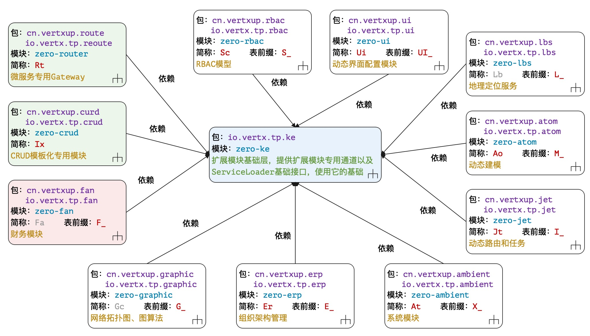
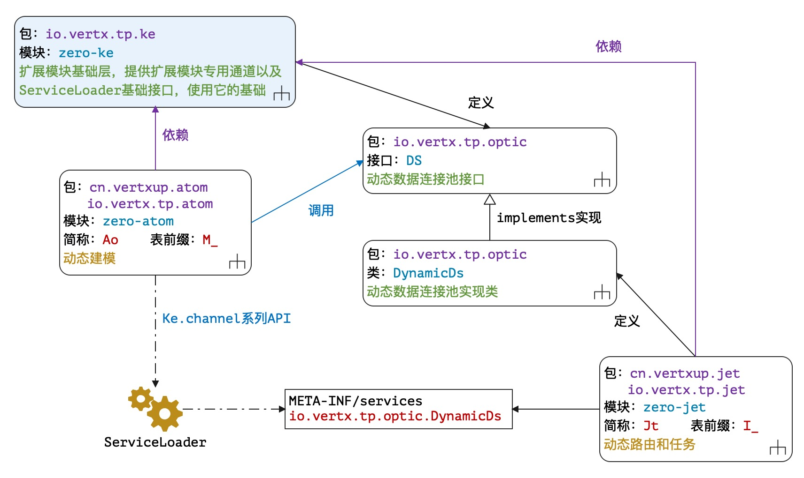

# 扬帆：Zero Extension

> 翩翩者鵻，载飞载下，集于苞栩。王事靡盬，不遑将父。——佚名《四牧》
* 项目地址：<https://github.com/silentbalanceyh/vertx-zero-example/>（子项目：**up-extension**）

## 「壹」背景

&ensp;&ensp;&ensp;&ensp;本章开始我们进入一个**新世界**：Zero Extension（`vertx-zero/vertx-pin`）——Zero扩展模块，扩展模块源起于2018年产品研发初始阶段，它给读者带来的是**开箱即用**的体验，既然是开箱即用，它和原始模块有一定的区别：

1. 扩展模块的每个**业务模块**都携带了一个SQL文件，该文件会帮助你创建该模块所需的表结构。
2. 某些扩展模块附带了一部分RESTful接口，一旦引入您就可以直接使用这些接口。
3. 扩展模块内容更多是以业务为主，这种情况若您要扩展，只能提交PR等待升级版本中进行改进。

&ensp;&ensp;&ensp;&ensp;扩展模块存在的意义是帮助您开发，这种帮助是让您远离Zero和技术，只是让自己精力集中于业务系统，但是它可能会满足不了您对复杂应用的需求，但由于框架本身是可变更的，这个可以让您逐步升级，即使您不使用扩展模块，依旧可以从中学习相关思路，这也是我们的初衷——**接触一个世界而看清这个世界，看清这个世界而看透这个世界，看透这个世界而看淡这个世界**。

### 1.1. 结构说明

&ensp;&ensp;&ensp;&ensp;整个Zero的扩展模块的完整结构如下：



&ensp;&ensp;&ensp;&ensp;这些扩展模块全部以`zero-ke`为基础，每个模块各自独立，模块和模块之前没有任何通信，两模块之间通信则使用Java中的ServiceLoader，相互之间不干涉、不影响。

|模块名|别名|表前缀|含义|
|---|---|---|:---|
|zero-ke|Ke|x|扩展模块基础层、抽象层以及共享层。|
|zero-crud|Ix|x|CRUD模板，标准化生成某个领域模型的基础15接口。|
|zero-router|Rt|x|微服务专用Gateway路由工具层。|
|zero-fan|Fa|`F_`|「保留」财务系统抽象模块，用于基础财务计算。|
|zero-graphic|Gc|`G_`|拓扑图专用表结构，描述点和线的网络图结构。|
|zero-erp|Er|`E_`|组织架构管理系统，管理企业基础组织架构。|
|zero-ambient|At|`X_`|应用、系统、模块专用，多应用配置管理结构。|
|zero-jet|Jt|`I_`|动态路由、动态接口管理。|
|zero-atom|Ao|`M_`|动态建模管理（无固定表结构）。|
|zero-lbs|Lb|`L_`|LBS地理定位服务。|
|zero-rbac|Sc|`S_`|RBAC模型，安全管理系统。|
|zero-ui|Ui|`UI_`|和前端相关的界面配置管理系统。|

> 无表前缀表示该模块不带数据表。

### 1.2. 基本规范

&ensp;&ensp;&ensp;&ensp;整个Zero Extension扩展模块中，最常用的是`zero-rbac`和`zero-crud`，它们前者为你快速部署整个系统的基础安全环境，后者为你的新表直接部署十五个标准化的CRUD接口，这部分深入到模块内部时再详谈。本小节讲一下Zero Extension部分的基础设计和开发规范，只要您在规范之内遵守规则，那么Zero就真让你有**零代码**的感觉了。

#### 1.2.1. 表设计

1. 整个系统中所有表名、字段名都使用大写，通常格式是`<P>_<NAME>`，其中`<P>`表示模块前缀。
2. 当您在设计系统时出现了**多对多**的情况，那么表名就使用`R_`前缀，R的含义为Relation。
3. 如果存在旧系统，您可以在Jooq生成领域模型时先对接旧的表名和字段名，之后使用Zero提供的**Pojo映射层**直接对接您想要的接口数据规范，如此完成转换、迁移和升级。

&ensp;&ensp;&ensp;&ensp;表名大写是整个Zero Extension在上了几个生产环境过后做出的决定，PgSQL和MySQL可直接配置成大小写敏感，而SQL Server是天生的大小写敏感，至于Oracle，不好意思，不支持小写——如此这般为兼容不同的主流数据库，所有的表名、字段名、以及语句中的SQL关键字全部使用大写，这种情况下，日志中出现全大写的情况您也可以第一时间知道它代表着什么，而且当您手写SQL语句时，一个Caplock键搞定。

&ensp;&ensp;&ensp;&ensp;除开上边的规则以外，Zero中还定义了部分表字段的基础命名规范：

|字段名|含义|
|---|:---|
|`KEY`|「不重复」表主键，该主键用UUID格式，通常是代理主键。|
|`CODE`|「不重复」系统编码，系统分配的唯一标识符，可做业务主键。|
|`SERIAL`|「不重复」系统编号，直接由编号系统产生，可表示订单号、账单号等。|
|`NAME`|记录名称，该名称为用户可读业务名，可称为标题，也可称为短名。|
|`TYPE`|记录所属类型，根据具体场景而定。|
|`ACTIVE`|记录锁定专用标识，为true则启用，false则禁用。|
|`SIGMA`|应用专用标识，对应到X-Sigma的自定义请求头。|
|`LANGUATE`|「保留」语言标识，对应到X-Lang的自定义请求头。|
|`METADATA`|Json格式，主要用于扩展配置处理，存储起来可针对记录特殊对待。|
|`CREATED_BY`|记录创建人。|
|`CREATED_AT`|记录创建时间。|
|`UPDATED_BY`|记录最后更新人。|
|`UPDATED_AT`|记录最后更新时间。|

> 上述字段中，`NAME, SERIAL`两个字段因业务而异，并不是所有的系统都会使用，而`CODE, TYPE`则是推荐字段，最好每张表保留，其他字段几乎是所有表都共享的字段。

&ensp;&ensp;&ensp;&ensp;上述基础表设计规范延伸到整个Zero扩展模块中，当然有人会说这个不好、有冗余、不是我想要的，Zero Extension本身打造的就是我们目前正在使用以及可用的东西，不是为谁量身打造的系统，这些字段的通用性和命名规范全程统一，那么您就可以抛开部分设计而直接开发业务了，之所以称为扩展模块，就是您**可以选择使用也可以选择不用**。此种设计还有一定的历史原因：

1. 主键命名为`KEY`，序列化过后会生成`key`属性，该属性对React的Jsx语法而言无缝集成，不需要做任何转换就可以实现前后端绑定，这样的设计节省了大部分接口开发的工作量；此处强调一点，Zero中的**Pojo映射层**可以帮助您完成字段名的映射，即使您用了ID作为系统表名，也可以在接口处直接转成`key`，但是设计**映射层**是为了兼容遗留系统，而不是为了您的特立独行，**约定**一直是Zero开发的核心。
2. SIGMA是统一标识，其实它的存在也在某种意义上给了系统一定的开发复杂度，使得Worker组件的签名变得不是那么纯粹，但是若要实现多租户、多应用、子系统，我们引入了最笨的设计，先放一个统一标识，之后再根据该标识进行鉴别，而为了隔离也做了许多工作，比如引入`X-Sigma`自定义头做前端隔离，以及在查询分析器上自动鉴别：当然如果是独立系统，该字段留空也可。
3. LANGUAGE是**拙劣的设计**，虽然是为了多语言处理，但也是沿用的之前旧产品ITSM中的玩法，将所有的字典以及消息全部存放在一张带有LANGUAGE字段的表中，当所有的呈现界面百川归海式放到那里过后，其他所有表的LANGUAGE就不重要了，但在现阶段，一边做开源一边做项目一边做产品，只能用快而暴力的方式处理，好在前端引入了`X-Lang`模式，之后升级修改后端架构就可以了。
4. Auditor相关的四个字段，以前称为`CREATE_BY，CREATE_TIME, UPDATE_BY, UPDATE_TIME`，为了保证这四个字段长度一致，参考ODOO老版本系统，在每张表中都引入了该四个字段，并且标准化，只是修改了名称：`CREATED_BY, CREATED_AT, UPDATED_BY, UPDATED_AT`，从英文语义上也可以讲得通。
5. 应该说最自由的设计是`METADATA`，该字段在数据库中存储成JSON格式，即我们为每一条数据提供了一个扩展空间，在部分前端模块中我们启用了这个扩展空间，借用之前讲过的Excel的功能把元数据导入到系统，该字段对配置数据和系统数据是一种福音，把部分**目前不可标准化**的设计全部暂存在该字段中，如此您就可以不担心突然来临的字段需求——当然多个版本过后做标准化是最好的。

&ensp;&ensp;&ensp;&ensp;上述历史原因导致了目前最终的表结构，这也是扩展模块的限制，若您不满足于此，要么选择提交PR修改扩展模块，要么就直接弃用也无不可，在快节奏的生活中，既要保证项目交付、又要保证开源运维、还保证产品研发，本身就是一个类似**战时变法**的做法，我们只能保证缓慢成长不断标准，而无法保证您一用就面面俱到。

#### 1.2.2. 包结构

&ensp;&ensp;&ensp;&ensp;Zero Extension部分的模块包结构几乎全面统一，思路一致，假设以`zero-rbac`模块为例：

* 项目名称：**zero-rbac**
* 包识别名：**rbac**
* 项目短名：**Sc**

&ensp;&ensp;&ensp;&ensp;包结构规范如下

> cn.vertxup您可以理解成自己的域名，可用其他代替，但若是开发新的Zero Extension扩展则依旧使用cn.vertxup而统一。

|包名|含义|
|:---|:---|
|cn.vertxup.rbac.api|RESTful接口主代码，Zero中的Worker/Agent组件。|
|cn.vertxup.rbac.domain|「Jooq生成」领域模型以及Dao。|
|cn.vertxup.rbac.ipc|「微服务」gRpc服务端和客户端代码。|
|cn.vertxup.rbac.service|业务逻辑层。|
|cn.vertxup.rbac.wall|rbac专有的@Wall的墙代码以及JSR340中Filter代码。|
|io.vertx.tp.error|自定义异常包。|
|io.vertx.tp.optic|ServiceLoader通道组件专用包。|
|io.vertx.tp.rbac.atom|自定义模型专用包。|
|io.vertx.tp.rbac.cv|专用常量包。|
|io.vertx.tp.rbac.init|初始化组件专用包，连接Zero中extension扩展初始化。|
|io.vertx.tp.rbac.refine|模块专用工具包。|
|io.vertx.tp.rbac.uca|自定义组件专用包。|

&ensp;&ensp;&ensp;&ensp;如果您开发的是Zero Extension的扩展，您可以遵循上述规范，实际上`cn.vertxup`是业务层之上的内容，而`io.vertx.tp`则是Zero专用的**第三方**根包名，放到此处的代码或多或少带有**标准化**的含义，一旦成型几乎不会变化。若您开发的就是自己的模块，那么直接使用一个包就可以了，只要您保证您的模块包相互之间不冲突即可，如将`io.vertx.tp`前缀直接改成`cn.vertxup`。

> 还有一种办法就是直接使用黑科技
> <http://www.vertxai.cn/document/doc-web/module-aj.html#.jplugin>，
> 执行命令`aj jplugin -m xxx`为您的Maven初始化项目自动化生成插件包，只是该插件是为集成模块量身打造的，包结构和Zero Extension中的包结构还有些许差异。

#### 1.2.3. RESTful接口设计

&ensp;&ensp;&ensp;&ensp;在Zero Extension中严格定义了两种不同的模式的接口前缀：

* 开放模式（无认证）：`/*`
* 安全模式（带认证）：`/api/*`

&ensp;&ensp;&ensp;&ensp;由于`zero-jet`中支持动态路由，所以引入静态和动态路由过后，您可以配置动态路由前缀，该前缀存储于`X_APP`表中（`zero-ambient`），但配置文件是位于`zero-jet`项目的配置文件中，假设您配置了两个应用：`ox`和`dr`（多应用），那么最终形成的RESTful表格如下：

|路径|含义|
|:---|:---|
|`/*`|平台无认证公共资源。|
|`/ox/*`|ox应用公共资源。|
|`/dr/*`|dr应用公共资源。|
|`/api/*`|平台带认证的安全资源、系统资源、配置资源等。|
|`/api/ox/`|ox应用安全资源。|
|`/api/dr/`|dr应用安全资源。|

&ensp;&ensp;&ensp;&ensp;上述模式下ox和dr是可配置的，所以您可以根据你自己的情况设计，当然不使用扩展模块那就是很自由的了，随意而为。

> Zero Extension更多的时候是给开发人员提供了一种无脑的设计，让您不用纠结技术选型、不用纠结某些需要您动脑筋的细节而直接上手开撸。

#### 1.2.4. 配置规范

### 1.3. 通道架构

&ensp;&ensp;&ensp;&ensp;虽然Zero各个模块之间不存在相互依赖关系，但是`zero-ke`定义了很多接口，而底层会有调用通道来实现各个模块之间的相互调用，参考下图：



&ensp;&ensp;&ensp;&ensp;通道结构主要启用了Java中的ServiceLoader技术，如图所示：

1. `zero-ke`中定义了接口`io.vertx.tp.optic.DS`，另外两个项目`zero-atom`和`zero-jet`都依赖于`zero-ke`的基础项目。
2. `zero-jet`中提供了该接口的实现类`io.vertx.tp.optic.DynamicDs`，并且将该类配置到ServiceLoader的部署文件中`META-INF/services/io.vertx.tp.optic.DynamicDs`文件。
3. `zero-atom`不依赖`zero-jet`，但依旧可直接拿到对应的实现类对象，完全基于接口调用。

&ensp;&ensp;&ensp;&ensp;其实这种结构类似于之前提过的反转控制，如果直接调用，两个模块之间无法解耦，而讲所有的控制权递交给`zero-ke`底层平台，那么模块和模块之间就没有必要再从Maven的pom.xml产生依赖了，至于查找类是否存在而不引起异常就是另外的话题了，最少Zero Extension可以保证一点，如果您不加载实现类的模块，最多让下边代码产生一定的副作用，但并不会引起大规模的坍塌。

```java
    private AoDao daoD() {
        return Ke.channelSync(DS.class, () -> null, ds -> {
            /* 连接池绑定数据库 */
            final DataPool pool = ds.switchDs(this.atom.sigma());
            if (Objects.nonNull(pool)) {
                /* 返回AoDao */
                final Database database = pool.getDatabase();
                return Ao.toDao(database, this.atom);
            } else return null;
        });
    }
```

&ensp;&ensp;&ensp;&ensp;有很多人反馈，Zero代码调用层次过深，抽象层次过深，有**过度设计**的情况发生，这一点我必须得承认，毕竟这是个人作品，有时候会有我的主观思维在其中，但设计的最终原则基本是一致的：

1. 只将对象分为**调用者**和**执行者**，二者相互协作完成整个世界，调用者不包含任何逻辑代码，执行者维持极限的**单一职责**基本原则。
2. 代码文件行数限定，调用者可视情况而定，如`Ux`代码虽然超过千行，但基本一览无余；执行者代码基本不超过50行（抽象层除外）。
3. 组件化和模块化代替，如果您拆过手表，那么您就理解其实更多的时候只需要造齿轮，多与少无所谓，就像解决Puzzle难题，最终结果达到即可，所以与其说Zero调用层次深，不如说是组件粒度很细。
4. 最后一点，要将如此规模的项目代码重复率压缩在5%以下，的确也是多次重构的结果，为了不重名、为了不重复、为了名称优雅，好几次重构几乎是破坏性极大的。

&ensp;&ensp;&ensp;&ensp;**万恶的NullPointer？**这一点我必须表态，**null的合法化**一直都是业界比较有争议的问题，但是我不排斥null，它像一把双刃剑，如果您用错了可能系统中的空指针异常会铺天盖地，但若您换一种思路处理，可能就会开辟另外一个新世界。Zero的前身是Vie系统，那时候为了极端摒弃null，我走过太多弯路，比如使用类似Oval这种在AOP层执行前验逻辑，又或者使用Java8中引入的Optional，但我只能说那种模式太痛苦，治标不治本（当然有可能是我功力不够，哈哈），技术解决不了系统设计问题，而更新换代换不掉您的架构思路，您必须在系统中拥抱一些特殊值。若您无法从设计层面解决null的问题，即使引入了Optional，您依旧会在前端开发中被undefined骚扰得怀疑人生。

&ensp;&ensp;&ensp;&ensp;相信阅读到这里，我不需要再给您解释Zero Extension具体是做什么的，它就像Zero之上的标准化模块，有了它您可以快速搭建**带业务**的系统而不需要去思考您的系统有些什么元素，当然它提供的内容可能远远不够，但后期版本逐渐成长，最少您有了**芽**，也在您茫然不知所措时有了一种选择。

## 「贰」zero-ke

&ensp;&ensp;&ensp;&ensp;`ke`是`kernel`的缩写，称为Zero Extension中的**内核**，**短名**一直是我在Zero中奉行的法则，其实软件编程过程中的命名规则考验的不是程序员的技术水平，而是英文底子。`zero-ke`作为整个扩展模块的神经中枢，它主要提供了下边几个核心功能：

1. 定义了所有模块所需的核心自定义异常。
2. 定义了所有模块可能会通用的特定数据模型。
3. 定义了所有所需要的通道接口。
4. 提供核心工具类`Ke`辅助每个模块正常运行。

&ensp;&ensp;&ensp;&ensp;该项目中有部分和rbac相关的内容，主要原因是`crud`模块和`rbac`模块实现了解耦，由于crud是一个半自动化项目，它在执行过程中会触发数据域的部分操作而执行API的生成和注入流程，于是只能将原本rbac中的部分内容直接迁移到ke中，如此两个业务模块不用耦合在一起——但如今看来有点多余，也许后续版本中会换一种结构，那就只能未完待续了。

### 2.1. 核心数据结构

### 2.2. 常用工具

### 2.3. 通道接口

## 「叁」小结


