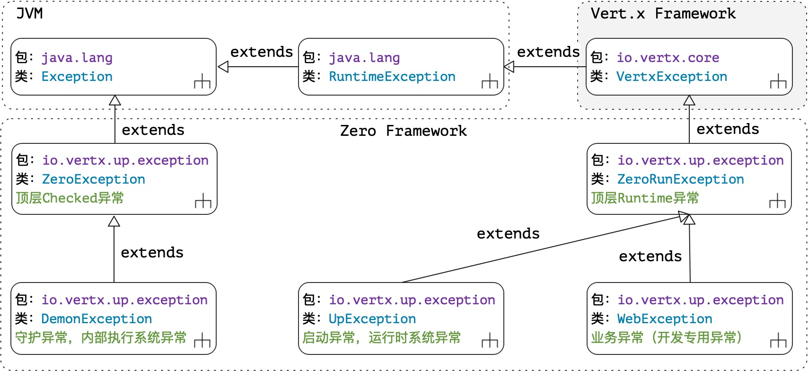

# 珠玉在侧：容错

> 其草有萆荔，状如乌韭，而生于石上，亦缘木而生，食之已心痛。——《山海经·西山经》

* 项目地址：<https://github.com/silentbalanceyh/vertx-zero-example/>（子项目：**up-rhea**）

##  「壹」异常处理

&ensp;&ensp;&ensp;&ensp;本文主要讲解Zero中的**容错**系统，很多读者在开发企业级系统时经常会面临一些问题，如：

* 如何处理JVM抛出的异常信息？
* 什么时候使用Runtime异常，什么时候又该使用Checked异常？
* 如何优雅地catch系统运行过程中的异常信息？

&ensp;&ensp;&ensp;&ensp;抱歉，我给不了你准确的答案，只能用本章的内容给你一个简单的参考，这也是Zero容错系统存在的意义。

### 1.1. 异常结构

&ensp;&ensp;&ensp;&ensp;如果要在自己的系统中处理好容错，我能给的最好的方案就是**设计自己的基础异常结构**，让系统中所有的异常按类别从自定义异常基础层去继承，并将自定义异常和JVM抛出的异常严格区分。Zero的基础异常结构如下图（包含Vert.x定义的异常）：




&ensp;&ensp;&ensp;&ensp;Zero中的顶层异常类定义在`io.vertx.up.exception`包中，两个根异常类和Java语言中的定义保持一致：

* Checked异常：ZeroException（代码中必须加上try/catch）。
* Runtime异常：ZeroRunException（父类是VertxException，和Vert.x定义一致）。

&ensp;&ensp;&ensp;&ensp;基于上述两个顶层异常类，按职责分为：

|类名|类型|含义|
|---:|---|:---|
|DemonException|Checked异常|系统异常，代码中必须try/catch。|
|UpException|Runtime异常|系统异常，Runtime类型。|
|WebException|Runtime异常|业务异常（开发人员关注点）。|

> UpException和DemonException部分为研发Zero时内部专用异常，开发人员不用关注。

### 1.2. WebException

&ensp;&ensp;&ensp;&ensp;Zero开发人员真正在使用时几乎只会用到`io.vertx.up.exception.WebException`，所以读者需要理解该异常的核心内容。

#### 1.2.1. 核心成员

|成员名|类型|含义|
|---|:---|:---|
|target|Class<?>|产生该异常的类，可定位异常出现位置。|
|status|HttpStatusCode|该异常绑定的HTTP状态代码，默认400 Bad Request。|
|message|String|「系统级」最终生成的异常描述信息。|
|readible|String|「业务级」最终生成的呈现在业务系统前端的可读信息。|
|params|Object[]|构造该异常的参数表（动参）。|

&ensp;&ensp;&ensp;&ensp;除开上述成员之外，WebException还定义了一个抽象方法：

```java
public abstract int getCode()
```

&ensp;&ensp;&ensp;&ensp;所有子类必须重写该方法，并且返回一个小于`-10000`的常量数值，系统会根据该数值从配置文件中生成异常描述信息，由于每个类的值都固定，所以不存在**成员**属性。

#### 1.2.2. 代码示例

&ensp;&ensp;&ensp;&ensp;通常定义一个WebException子类的代码如下：

```java
package io.vertx.up.exception.web;

import io.vertx.core.http.HttpStatusCode;
import io.vertx.up.exception.WebException;

import javax.ws.rs.core.MediaType;

public class _415MediaDeclareException extends WebException {
    public _415MediaDeclareException(final Class<?> clazz,
                                     final Class<?> argType, final MediaType type) {
        super(clazz, argType.getName(), type.toString());
    }

    @Override
    public int getCode() {
        return -40069;
    }

    @Override
    public HttpStatusCode getStatus() {
        return HttpStatusCode.UNSUPPORTED_MEDIA_TYPE;
    }
}
```

&ensp;&ensp;&ensp;&ensp;配置文件描述如：

```yaml
E40069: "(415) - The declared type {0} is not match to MIME {1}"
```

#### 1.2.3. 开发规则

&ensp;&ensp;&ensp;&ensp;开发WebException的基本规则如下：

1. 定义的WebException子类名称统一使用`_NxxxException`的格式
    * N：一个三位的数字，对应HTTP状态代码。
    * xxx：该异常的主体描述信息，通常是1 ~ 4个单词描述。
2. getStatus()：如果您定义的异常是400（Bad Request），那么可以忽略该方法的重写，而其他值必须重写，——注：getStatus()返回的状态描述信息必须和类名中的数字保持一致。
3. 构造函数：
    * 首参必须是`Class<?>`——标识该异常产生的类。
    * 除开首参以外，后续参数表和定义在配置文件中的内容一致，包含类似`{0},{1}`的占位符：
4. getCode()：该方法必须返回一个负数，系统会根据它的值去配置文件中查找对应的文字描述模板，如果定义的错误代码为`-40069`，则配置文件中的键值为`E40069`（文件格式为yaml）。

&ensp;&ensp;&ensp;&ensp;由于异常信息的生成使用了MessageFormat构造，所以提及部分Java语言中的特殊符号规则：

1. 如果要在文字中输出单引号`'`，必须使用`''`代替。
2. 如果要在文字中输出双引号`"`，必须使用`\"`转义符号代替。

### 1.3. 相关配置

&ensp;&ensp;&ensp;&ensp;Zero容错系统主要包含三个配置文件（src/main/resources目录中）：

|文件路径|分类|含义|
|:---|---|:---|
|up/config/vertx-error.yml|系统配置|该配置不可变更，随着Zero版本升级会有所改动。|
|vertx-error.yml|用户配置|该文件由开发人员提供，对WebException进行扩展时专用。|
|vertx-readible.yml|用户配置|该文件由开发人员提供，用于定义对应的文字描述。|

&ensp;&ensp;&ensp;&ensp;WebException被序列化成Json时会生成如下格式的异常信息：

```json
{
    "code": "数值，对应getCode()返回值",
    "message": "系统描述信息，对应vertx-error.yml中格式化后的描述信息",
    "info": "业务描述信息，若在vertx-readible.yml中定义了该异常，则该节点存在"
}
```

&ensp;&ensp;&ensp;&ensp;一个`vertx-readible.yml`中的片段如：

```yaml
80220: "对不起，您的账号被锁定了，请联系管理员！"
```

&ensp;&ensp;&ensp;&ensp;使用`vertx-readible.yml`扩展异常信息时，它的代码值可以是系统内置定义的代码，也可以是用户自定义的代码，且代码无需使用`E`前缀。这种设计主要针对容错系统的扩展点，最初的配置设计如下：


&ensp;&ensp;&ensp;&ensp;在这种设计中，同一个错误代码可在**日志系统**中执行等级切换，（I-Info，W-Warn，E-Error），而这三种信息在业务环境中可能是一致的，于是就有了`vertx-error.yml`中的多重定义键值带`E`前缀。

>  目前的版本中很少出现W和I的场景，于是这个设计就保留下来了。

##  「贰」异常查询表

&ensp;&ensp;&ensp;&ensp;Zero中使用了严格的异常定义，有了该查询表，开发人员就可以在内部异常发生时更容易**调试**，异常查询表中只包含非`abstract`类型的异常类。

> 文字中的描述是触发该异常的条件，即异常发生条件。

### 2.1. ZeroRunException子类

包名：**io.vertx.up.exception.heart**

|类名|触发条件|
|---:|:---|
|AptParameterException|Apt是Zero中的比对专用对象，比对过程中，旧值新值同时为空。|
|ArgumentException|函数参数非法异常，当前版本用于检查参数长度不符合预期。|
|EmptyStreamException|文件无法读取。|
|ErrorMissingException|检查vertx-error.yml中未找到对应code的错误描述。|
|JexlExpressionException|JEXL表达式解析出错。|
|LimeFileException|vertx.yml文件中配置的lime节点文件不存在。|
|PoolKeyNullException|池化传入参数`key`为null，ConcurrentHashMap不允许null键。|
|DateFormatException|「保留」时间格式非法。|
|JsonFormatException|「保留」读取内容格式为非法Json格式，无法序列化。|
|OperationException|「保留」反射函数执行出错。|

### 2.2. DemonException子类

包名：**io.vertx.up.exception.demon**

|错误码|类名|触发条件|
|---|---:|:---|
|-10001|JObjectElementException|一个JsonArray中的元素不全是JsonObject。|
|-10002|RequiredFieldException|JsonObject中丢失/不包含某个field数据。|
|-10003|DataTypeWrongException|JsonObject中某个field的数据类型不符合预期。|
|-10004|ClusterConflictException|Vert.x集群环境和配置文件内容冲突。|
|-10006|ForbiddenFieldException|JsonObject出现了不支持的属性。|
|-30001|ServerConfigException|vertx.yml配置文件中`server`节点配置非法。|

### 2.3. UpException子类

包名：**io.vertx.zero.exception**

|错误码|类名|触发条件|
|---|---:|:---|
|-40001|UpClassArgsException|主程序run方法传入clazz为空。|
|-40002|UpClassInvalidException|主程序run方法传入的clazz丢失了@Up注解。|
|-40003|VertxCallbackException|Zero启动器无法正确连接Vertx实例。|
|-40004|AgentDuplicatedException|针对某一种服务器类型，Agent定义出现了重复！|
|-40005|EventSourceException|扫描的Event执行类没有被@EndPoint注解。|
|-40006|PathAnnoEmptyException|JSR311中@Path注解不完全，不符合规范。|
|-40007|MethodNullException|解析HTTP方法时，没找到合法的Method。|
|-40008|EventActionNoneException|Java定义的Handler执行方法Method为null，无法执行。|
|-40009|NoArgConstructorException|Zero要求的类没包含无参构造函数。|
|-40010|AccessProxyException|Java方法访问控制域不是public。|
|-40011|ParameterConflictException|「保留」Zero扫描时发现了游离方法。|
|-40012|AddressWrongException|@Address注解丢失了配置，Agent或Worker丢失其中一个。|
|-40013|ReturnTypeException|启用EventBus时，Agent组件的方法返回值为void。|
|-40014|WorkerMissingException|无法找到正确的@Queue,@Address注解的Worker组件。|
|-40017|WorkerArgumentException|Worker组件方法签名中参数列表非法。|
|-40018|AsyncSignatureException|异步模式下方法签名出错，非异步方法定义。|
|-40021|MultiAnnotatedException|Zero注解在某些场景下出现了重复使用和定义。|
|-40023|QualifierMissedException|JSR330扫描时丢失了@Qualifier注解。|
|-40024|NamedImplementionException|JSR330定义时丢失了@Named注解。|
|-40025|NamedNotFoundException|JSR330扫描时没找到@Named匹配的类。|
|-40029|AnnotationRepeatException|元数据注解次数不符合预期。|
|-40030|ParamAnnotationException|JSR311注解参数类型出现了多类型重复参数定义。|
|-40032|IndexExceedException|Envelop按索引读取数据的传入索引非法（大于等于0）。|
|-40042|ChannelMultiException|@Address和@Ipc两个同时使用（二选一）。|
|-40043|IpcMethodTargetException|找到@Ipc的发送者，但没找到接受者。|
|-40044|IpcMethodReturnException|@Ipc注解方法的返回值为void（必须包含返回值）。|
|-40045|UnknownDirectionException|RPC流式模式数据发送方向无法判断。|
|-40046|IpcMethodArgException|@Ipc注解方法参数签名错误（只能是Envelop单参）。|
|-40047|InvokerNullException|扫描@Queue时没有匹配到正确的调用方法Method。|
|-40048|RpcAgentAbsenceException|RPC流式系统中出现了没有实现类的独立接口。|
|-40049|WorkerConflictException|Worker组件签名冲突。|
|-40050|MicroModeUpException|微服务模式下etcd的基础配置没准备好。|
|-40051|FilterContextException|JSR340执行时，未正确绑定RoutingContext引用。|
|-40052|FilterSpecificationException|JSR340执行时，被@WebFilter注解的类未实现`Filter`接口|
|-40053|FilterOrderException|JSR340执行时，Handler的顺序order为负（大于等于0）。|
|-40054|FilterInitialException|JSR340执行时，未找到注解了@WebFilter的类。|
|-40064|ActSpecificationException|批量模式和单量模式调用方法和数据不一致。|

包名：**io.vertx.up.exception.zero**

|错误码|类名|触发条件|
|---|---:|:---|
|-10005|DynamicKeyMissingException|统一配置中丢失了动态key配置。|
|-10007|DynamicConfigTypeException|某个动态key对应配置不是JsonObject。|
|-40020|ConfigKeyMissingException|容器配置中需要的某个配置丢失。|
|-40026|InjectionLimeKeyException|启用了插件，但lime扩展配置丢失。|
|-40027|EtcdConfigEmptyException|EtcdClient配置丢失。|
|-40028|DuplicatedImplException|某个接口中出现了多个实现类（要求单class实现）。|
|-40039|EtcdNetworkException|Etcd配置的服务端无法连接，网络出错。|
|-40055|JooqCondFieldException|无法根据字段找到正确的查询条件分析器。|
|-40057|JooqMergeException|两个实体拷贝出现了null指针，无法执行。|
|-40058|JooqModeConflictException|「保留」Jooq模式非法。|
|-40059|JooqFieldMissingException|某个字段名在实体类中找不到，字段名非法。|
|-40060|JooqVertxNullException|Jooq未正确绑定Vertx实例。|
|-40062|TestCaseNameException|测试用例名称不符合Zero测试框架规范。|
|-40063|InvokingSpecException|定义了返回值void的方法，但参数列表不符合规范。|
|-40065|JooqConfigurationException|配置数据中没找到正确的Jooq数据库配置（provider）。|
|-40066|JooqClassInvalidException|Jooq传入类不是一个VertxDAO。|
|-40067|JooqCondClauseException|无法根据字段类型找到Jooq子句执行器。|
|-45001|ReduceVerticalException|「保留」JsonArray中某一列的值不是单值。|

包名：**io.vertx.tp.error**

|错误码|类名|触发条件|
|---|---:|:---|
|-40015|PluginOptionException|插件系统读取失败。|
|-40016|PluginSpecificationException|插件系统不符合规范，丢失静态方法`init(Vertx)`。|
|-40019|PluginUpException|插件系统启动失败。|
|-40033|XtorConnectException|「保留」XTor组件连接失败。|
|-40034|XtorNotReadyException|「保留」XTor组件没准备好，初始化失败。|
|-40035|XtorExecuteException|「保留」XTor组件执行失败。|
|-40036|EventCodexMultiException|@Codex注解多次，验证系统配置出错。|
|-40037|RpcPreparingException|开启RPC，但远程Etcd环境未准备好。|
|-40038|WallDuplicatedException|安全模式中，@Wall注解的类出现重复。|
|-40040|WallKeyMissingException|@Wall注解关联配置丢失。|
|-40041|WallMethodMultiException|@Wall类中方法定义规范错误。|
|-40056|DataSourceException|数据库连接池初始化失败。|
|-40070|InternalConflictException|控制台启动器被重写或破坏。|
|-40071|CommandParseException|控制台输入的命令无法被正确解析。|
|-40072|CommandMissingException|控制台输入命令丢失。|
|-40073|CommandUnknownException|控制台命令无法识别。|
|-40074|PluginMissingException|无法找到控制台命令的执行器。|

### 2.4. WebException子类

> 类名自带状态代码，此处不新增列枚举。

#### 2.4.1. 标准异常

包名：**io.vertx.up.exception.web**

|错误码|类名|触发条件|
|---|---:|:---|
|-20005|_500SessionClientInitException|SessionClient初始化失败。|
|-40061|_500SecurityNotImplementException|系统打开了Zero安全模块，但未找到@Wall注解类。|
|-40069|_415MediaDeclareException|「保留」服务端偏好MIME错误。|
|-40068|_411ContentLengthException|上传文件大小非法，Content-Length不匹配。|
|-60000|_400ValidationException|标准400验证异常，参数验证失败。|
|-60001|_400ResourceBuildingException|「保留」请求内容无法正确转换。|
|-60002|_500DeliveryErrorException|数据在Delivery过程中出错。|
|-60003|_500EntityCastException|实体、对象类型转换出错。|
|-60004|_400ParameterFromStringException|参数数据转型出错。|
|-60005|_400ValidationRuleException|标准400验证异常，Body验证失败。|
|-60006|_415MediaNotSupportException|MIME和服务端不匹配。|
|-60007|_500InternalServerException|标准500异常。|
|-60008|_404RecordNotFoundException|「保留」存储storage中无法找到数据。|
|-60009|_400DuplicatedRecordException|「保留」存储storage记录重复异常。|
|-60010|_404ServiceNotFoundException|标准404异常。|
|-60011|_400BadRequestException|标准400异常。|
|-60012|_401UnauthorizedException|标准401异常。|
|-60013|_403ForbiddenException|标准403异常。|
|-60014|_405MethodForbiddenException|标准405异常。|
|-60015|_501RpcImplementException|RPC服务无法找到，有可能无实现代码。|
|-60016|_501RpcAddressWrongException|RPC通讯地址出错。|
|-60017|_504RemoteRpcException|「保留」RPC远程服务执行代码出错。|
|-60018|_501RpcMethodMissingException|微服务无法找到RPC执行方法。|
|-60019|_500UnexpectedRpcException|RPC通讯异常。|
|-60020|_424RpcServiceException|无法根据名称找到匹配的RPC服务。|
|-60021|_400FilePathMissingException|上传文件路径出错。|
|-60022|_400QueryKeyTypeException|Ir配置中的属性类型非法。|
|-60023|_400PagerInvalidException|pager参数丢失了必须属性。|
|-60024|_500QueryMetaNullException|查询引擎参数元数据定义为null。|
|-60025|_400PagerIndexException|「保留」pager参数的page属性非法。|
|-60026|_400OpUnsupportException|查询引擎操作符非法。|
|-60027|_501RpcRejectException|当前请求的RPC被拒绝，不支持该服务。|
|-60028|_500RpcMethodInvokeException|RPC方法调用过程中出现了不可预知的错误。|
|-60029|_401JwtExpiredException|Jwt的令牌token过期，请重新申请。|
|-60030|_401JwtAudientException|Jwt的audient参数非法，认证失败。|
|-60031|_401JwtIssuerException|Jwt的issuer参数非法，认证失败。|
|-60032|_500JwtRuntimeException|Jwt运行环境异常。|
|-60033|_401JwtExecutorException|Jwt执行结果为false，认证失败。|
|-60034|_501SharedDataModeException|SharedMap调用中同异步模式冲突。|
|-60035|_500PoolInternalException|SharedMap共享池操作过程出错。|
|-60036|_500RpcTransitInvokeException|RPC流模式中Transit调用出错。|
|-60040|_412ContractFieldException|@Contract修饰属性时出现了重复（只能注解一次）。|
|-60041|_417JobMethodException|后台任务的方法参数定义错误。|
|-60042|_501JobOnMissingException|后台任务类中未定义任何@On的方法。|
|-60044|_500PointerPluginException|「保留」插件引用出错。|
|-60046|_500RequestConfigException|WebClient配置数据出错。|
|-60047|_501HttpClientNullException|WebClient实现类找不到，环境出错。|
|-60045|_400SigmaMissingException|Header中丢失了X-Sigma参数导致sigma无法读取。|

#### 2.4.2. 插件异常

包名：**io.vertx.tp.error**

##### zero-ifx-es

|错误码|类名|触发条件|
|---|---:|:---|
|-20006|_404ConfigurationMissingExceptionn|ElasticSearch配置丢失。|
|-20007|_404IndexNameMissingExceptionn|输入数据中丢失了Index名。|
|-20008|_404SearchTextMissingExceptionn|全文检索中丢失了输入关键字。|

##### zero-ifx-excel

|错误码|类名|触发条件|
|---|---:|:---|
|-60037|_404ExcelFileNullException|Excel文件丢失，无法构造Workbook。|
|-60038|_404ConnectMissingException|ExcelClient专用配置丢失。|
|-60039|_500ExportingErrorException|Excel导出数据出错。|

##### zero-ifx-iqiy

|错误码|类名|触发条件|
|---|---:|:---|
|-20001|_401QiyAuthorizedException|访问爱奇艺接口`/iqiyi/authorize`出错。|
|-20001|_401QiyExecuteException|同上，且code一致。|
|-20002|_401QiyTokenException|数据记录中缺少`access_token`，无法访问API。|

##### zero-ifx-redis

|错误码|类名|触发条件|
|---|---:|:---|
|-60043|_409SessionVersionException|会话Session中的新旧版本不一致，匹配失败。|

##### zero-ifx-sms

|错误码|类名|触发条件|
|---|---:|:---|
|-20003|_424ProfileEndPointException|阿里短信客户端无法执行初始化。|
|-20004|_424MessageSendException|阿里短信客户端发送消息失败。|

#### 2.4.3. 扩展模块异常

包名：**io.vertx.tp.error**

>  Extension模块中的OOB定义。

##### zero-ambient

|错误码|类名|触发条件|
|---|---:|:---|
|-80300|_500AmbientErrorException|无法读取应用数据。|
|-80301|_500ApplicationInitException|无法初始化name对应的应用程序，包括配置。|
|-80302|_500InitSpecificationException|无法找到Init初始化接口实现类。|
|-80303|_500PrerequisiteSpecException|无法找到Prerequisite预处理接口实现类。|

##### zero-atom

|错误码|类名|触发条件|
|---|---:|:---|
|-80500|_409UniqueConstraintException|「保留」数据库底层出现了Unique约束异常。|
|-80501|_500DdlExecuteException|数据库SQL的DDL语句执行失败。|
|-80502|_500EmptySQLException|执行的SQL语句为空（null或""）。|
|-80503|_501IngestImplementException|Ingest接口实现类非法。|
|-80504|_500NullableAddException|无法用DDL添加NOT NULL列。|
|-80505|_500NullableAlterException|因为修改列有数据无法修改为NOT NULL。|
|-80506|_501AoReflectorNullException|关联组件AoReflector为null，跨表修改会失败。|
|-80507|_501AoSentenceNullException|语句组件AoSentence为null，无法垮库兼容。|
|-80508|_501PinNotFoundException|无法初始化环境中的Pin组件，不能访问库。|
|-80509|_500TypeAlterException|数据库中的列类型无法更改（类型不兼容）。|
|-80510|_404ModelNotFoundException|无法根据identifier查找到合法的Atom模型定义。|
|-80511|_400ExcelAppConflictException|Excel导入导出模块格式异常，出现了冲突。|
|-80512|_400ExcelTplErrorException|Excel导入文件中的数据内容不符合模板定义。|
|-80514|_417PrimaryKeyResultException|主键五种模式和执行器产生了冲突。|
|-80515|_417PrimaryKeySizeException|一个模型Model中定义的主键规范尺寸不对。|
|-80516|_417PrimaryKeySpecException|模型中主键定义规范出错，未满足Zero定义的范式。|
|-80517|_417DataAtomNullException|系统检测到为null的DataAtom引用。|
|-80518|_417DataTransactionException|数据库DML语句执行时出SQL底层错。|
|-80519|_417DataUnexpectException|数据库DML数据执行结果不匹配。|
|-80520|_417PrimaryKeyMissingException|（同80535）模型定义中中没找到任何主键定义。|
|-80521|_417SqlExecutingException|数据库SQL的DML语句执行失败。|
|-80522|_417ConditionEmptyException|您想构造查询引擎所需条件，但DataMatrix为空。|
|-80523|_417ConditionWhereException|Where子句无参数元素，无法构造查询条件。|
|-80524|_417TableCounterException|表执行Join时表数量和模型定义中不匹配。|
|-80525|_500ConditionFieldException|查询字段转换成表字段后非法，在表中不存在。|
|-80526|_400FileRequiredException|上传的文件为null，请上传合法文件。|
|-80527|_400KeyLengthException|上传文件为空或者文件数量不合法。|
|-80529|_404RecordMissingException|无法查询到您想要的数据记录。|
|-80530|_409CodeUnsupportException|code字段相关逻辑不合法，系统不支持。|
|-80531|_409IdentifierConflictException|上传文件中的模型标识identifier不匹配。|
|-80532|_417DataEmptyException|上传文件中没有任何数据。|
|-80533|_417DataRowNullException|构造的DataRow为null。|
|-80534|_417EventTypeConflictException|构造单记录DataEvent时使用了多参数，类型冲突。|
|-80535|_417PrimaryAttrWrongException|模型定义中没找到任何主键。|
|-80536|_417RelatedFieldMissingException|无法找到`M_JOIN`中定义的关联模型字段。|
|-80537|_417RelatedSchemaMissingException|无法找到`M_JOIN`中定义的关联模型。|
|-80538|_417RelationCounterException|一个模型Model关联的Schema数量不对。|
|-80539|_501FabricIssueException|当前环境的字典翻译器为null。|
|-80540|_501AnonymousAtomException|系统无法断定DataAtom关联到哪个定义的模型。|
|-80541|_409ReferenceDaoException|「保留」sourceReference中配置的Dao过量，冲突。|
|-80544|_500AtomFirstException|「保留」未绑定DataAtom之前不可执行Model的绑定。|
|-80545|_400TrackingErrorException|新旧记录同时为空，无法生成变更历史。|
|-80546|_500ExcelFileNullException|「保留」Excel文件对象出现了null。|

##### zero-crud

|错误码|类名|触发条件|
|---|---:|:---|
|-80100|_404ModuleMissingException|plugin/crud/module目录下丢失了配置文件。|
|-80101|_404ColumnStubNullException|启用CRUD时丢失了`column`的配置信息。|
|-80102|_409MultiModuleException|系统无法定位唯一模型，模型二义。|
|-80103|_409ModuleConflictException|请求表名和实际定义表名不匹配，冲突。|

##### zero-jet

> 这里定义的WebException是配置和动态路由模块专用，请和标准的400区分。

|错误码|类名|触发条件|
|---|---:|:---|
|-80400|_500AmbientConnectException|UnityApp为空，无法连接Ambient环境。|
|-80401|_501IngestMissingException|DEFINE模式下摄取器插件实现类丢失。|
|-80402|_501IngestSpecException|DEFINE模式下摄取器插件未实现JtIngest。|
|-80403|_400RequiredParamException|Web请求中必填参数丢失。|
|-80404|_500WorkerSpecException|Worker组件不是一个合法的Verticle。|
|-80405|_500ConsumerSpecException|JtConsumer组件定义错误。|
|-80406|_500DefinitionErrorException|IApi/IService基础配置出错。|
|-80407|_501ChannelErrorException|通道组件初始化失败。|
|-80408|_424ChannelConflictException|通道组件和通道类型冲突。|
|-80409|_424ChannelDefinitionException|通道类的Java定义错误。|
|-80410|_424ChannelDefineException|使用自定义通道DEFINE，但缺少实现类。|
|-80411|_500EnvironmentException|sigma无法查询应用程序数据及引用。|
|-80412|_501DataSourceException|数据源切换时出错，多数据源动态环境异常。|
|-80413|_501NotImplementException|（同80218）系统执行了未实现的API，忘记重写。|

##### zero-ke

|错误码|类名|触发条件|
|---|---:|:---|
|-80214|_409SessionConflictException|Session会话过期或已销毁。|
|-80216|_501ChannelNotImplementException|ServiceLoader触发时无法找到合法实现类。|
|-80217|_501JooqReferenceException|无法构造合法的UxJooq实例。|
|-80218|_501NotSupportException|系统执行了未实现的API，忘记重写。|
|-80219|_403TokenGenerationException|无权限创建跨应用账号令牌。|
|-80542|_409JoinTargetException|双表JOIN时未找到对端实体。|
|-80543|_404IndentParsingException|双表JOIN时未找到对端实体类主键。|

##### zero-rbac

|错误码|类名|触发条件|
|---|---:|:---|
|-80200|_401CodeWrongException|您提供的临时授权码不匹配。|
|-80201|_401CodeExpiredException|临时授权码过期，超过30秒。|
|-80202|_401CodeGenerationException|临时授权码生成出错。|
|-80203|_449UserNotFoundException|账号不存在。|
|-80204|_401PasswordWrongException|登录过程密码错。|
|-80205|_403ProfileConflictException|登录的Profile和资源需求Profile不匹配。|
|-80206|_401TokenCounterException|该用户的Token令牌数量不对。|
|-80207|_401TokenInvalidException|该用户提供的Token不匹配。|
|-80208|_401TokenExpiredException|该用户的Token过期。|
|-80209|_403ActionMissingException|请求的安全操作未定义或找不到。|
|-80210|_404ResourceMissingException|请求资源不存在。|
|-80211|_403ActionDinnedException|操作级别无法达到资源定义级别。|
|-80212|_403NoPermissionException|账号无权限。|
|-80213|_403PermissionLimitException|账号权限被限制无法访问资源。|
|-80215|_500DwarfInstanceNullException|Acl计算时Dwarf引用为null，检查配置。|
|-80220|_401UserDisabledException|用户被锁，账号禁用。|

##  「叁」异常代码说明

&ensp;&ensp;&ensp;&ensp;上述异常查询表中包含了Zero框架内部不可更改的系统内部异常，并提供了十分良好的扩展空间，而开发人员可以按照下边的表格开发自己要使用的异常信息。

|code起点|code终点|带状态码|含义|
|---|---|---|:---|
|10000|19999|No|ZERO框架自身异常，消息通常会包含`(V) - `的前缀，<br/>这种类型的异常通常是从`UpException`继承。|
|20000|29999|Yes|第三方插件专用异常，第三方插件主要是针对带有Vendor<br/>生产商的，且前缀使用`(HTTPCODE) - `。
|30000|39999|No|Vert.x和Zero内部桥接专用异常，该区域保留。|
|40000|45000|No|Zero容器运行时异常，和容器规范相关的核心异常。|
|45001|49999|No|「保留」Zero容器Rx模式下运行时异常。|
|60000|69999|Yes|Zero执行RESTful过程中的标准请求异常。|
|80000|89999|Yes|Zero Extension扩展模块专用异常。|

&ensp;&ensp;&ensp;&ensp;所以推荐读者在使用Zero异常时尽可能使用小于`-100000`的代码，以免和Zero系统定义的异常冲突，您也可以使用单数前缀空间，只要您定义的异常和上述异常查询表中的代码不重复即可。

>  最后吐槽一点，不要只定义400，500，404，如何定义参考HTTP状态代码的说明，尽量放开使用4XX和5XX。

##  「肆」小结

&ensp;&ensp;&ensp;&ensp;本章节主要介绍了Zero中的核心容错系统，也提供了详细的Zero容器内部的异常查询表给读者，有关Zero Extension部分的教程会在后续教程中加以说明，至于WebException在实际代码中如何使用我将在后续章节用实例来说明，这部分牵涉到Worker中的代码布局。
