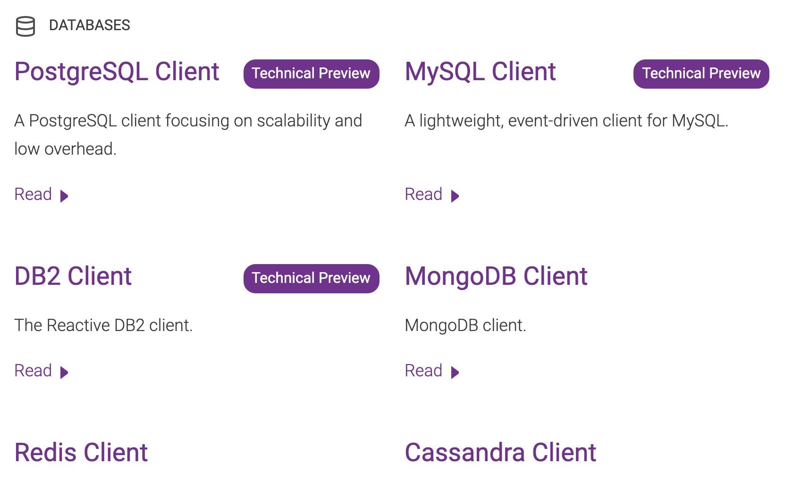
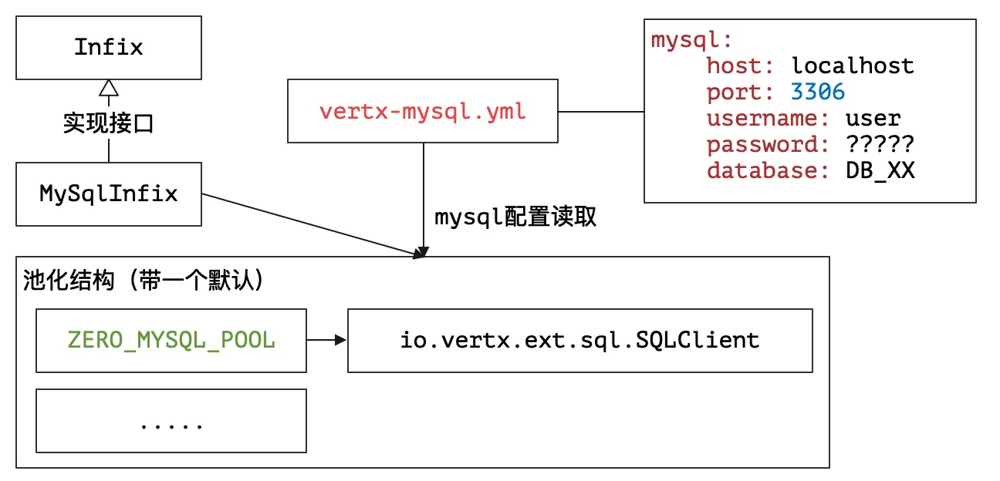

# 始源之地：Vert.x集成

>  考槃在涧，硕人之宽。独寐寤言，永矢弗谖。——佚名《国风·卫风》

* 项目地址：<https://github.com/silentbalanceyh/vertx-zero-example/>（子项目：**up-native**）

## 「壹」Vert.x子项目

&ensp;&ensp;&ensp;&ensp;Vert.x从3.x开始，就将曾经的工具箱重新进行了模块化设计，您可以在官方文档中看到很多相关子项目（2.x中的模块化完全是灾难级的）：



&ensp;&ensp;&ensp;&ensp;可能您会困惑，如果使用Zero，是不是就用不了这些相关的子项目了呢？答案是否定的，在Zero中您可以开发**连接点**程序，有了它您可以直接和Vert.x提供的官方子项目集成（类似`MySQL Client`），也可以和Zero中设计的标准插件集成。Zero中的标准插件主要源起于实战，有些插件是Vert.x的子项目未提供的，而两种插件的引入使用统一的模式，Zero的玩法不一定最炫，但铁定会让您眼前一亮！

> `ifx`全称为`infix`，翻译为“中缀、插入”。

&ensp;&ensp;&ensp;&ensp;Zero的子项目`vertx-ifx`中包含了目前支持的所有插件，这些插件的开发流程都遵循了本章节的思路，其中还包含类似**Neo4j**、**ElasticSearch**、**Excel**等官方不支持的集成，一旦您学会了本章的完整开发思路，那么您的项目自然如虎添翼。目前的插件如下表：

|项目名|类型|含义|
|:---|---|:---|
|zero-ifx-es|Zero|ElasticSearch功能模块。|
|zero-ifx-excel|Zero|Excel导入导出功能模块（可直连Jooq功能模块）。|
|zero-ifx-feign|Zero|Feign功能模块。|
|zero-ifx-history|Zero|系统读写日志历史数据库（第二库）。|
|zero-ifx-iqiy|Zero|Qiy爱奇艺视频客户端。|
|zero-ifx-neo4j|Zero|Neo4j的非SQL数据库图库集成模块。|
|zero-ifx-shell|Zero|命令行工具抽象框架。|
|zero-ifx-mongo|Vertx|Mongo数据库客户端。|
|zero-ifx-native|Vertx|MySQL和PgSQL客户端专用集成（标准）。|
|zero-ifx-redis|Vertx|Redis功能模块。|
|zero-ifx-sms|Vertx|阿里云手机短信服务。|

&ensp;&ensp;&ensp;&ensp;**表格中的类型**标识了该插件是Vert.x集成插件还是Zero的集成插件，本章不去剖析部分复杂的插件用法，后续会有单独的章节讲解，主要告诉读者：

1. 如何在Zero中开发这种插件项目以及**连接点**程序（如何扩展）。
2. 如何在您的Agent/Worker组件中使用这些扩展。

&ensp;&ensp;&ensp;&ensp;这些插件的设计以**单一职责**为原则，项目本身比较小，代码不多，目的也是让您在选择时可直接根据所需**按需引入**。

### 1.1. MySQL孤岛

#### 1.1.1. 插件开发

&ensp;&ensp;&ensp;&ensp;Zero中使用了MySQL，但由于**动态建模**的影响，并没有使用Vert.x中的`MySQL Client`，而是将Jooq标准化了。有关`MySQL Client`的引入目前存在于`zero-ifx-native`项目中，它只包含了一个代码文件：

```java
package io.vertx.up.plugin.jdbc;

import io.vertx.core.Vertx;
import io.vertx.ext.asyncsql.MySQLClient;
import io.vertx.ext.sql.SQLClient;
import io.vertx.up.annotations.Plugin;
import io.vertx.up.eon.Plugins;
import io.vertx.up.fn.Fn;
import io.vertx.up.plugin.Infix;

import java.util.concurrent.ConcurrentHashMap;
import java.util.concurrent.ConcurrentMap;

@Plugin
@SuppressWarnings("unchecked")
public class MySqlInfix implements Infix {

    private static final String NAME = "ZERO_MYSQL_POOL";

    private static final ConcurrentMap<String, SQLClient> CLIENTS
            = new ConcurrentHashMap<>();

    private static void initInternal(final Vertx vertx,
                                     final String name) {
        Fn.pool(CLIENTS, name, () -> 
            Infix.init(
                Plugins.Infix.MYSQL,
                (config) -> MySQLClient.createShared(vertx, config, name),
                MySqlInfix.class
            )
        );
    }

    public static void init(final Vertx vertx) {
        initInternal(vertx, NAME);
    }

    public static SQLClient getClient() {
        return CLIENTS.get(NAME);
    }

    @Override
    public SQLClient get() {
        return getClient();
    }
}
```

&ensp;&ensp;&ensp;&ensp;把它称为**孤岛**，就是因为整个`zero-ifx-native`项目中只有这个文件，而这个文件却包含了很多巧思，也包含了Zero插件结构的骨架代码。
&ensp;&ensp;&ensp;&ensp;接口`io.vertx.up.plugin.Infix`是Zero中为第三方功能模块设计的插件接口，实现该接口的类必须包含两个基本规范：

1. 这是一个插件，必须被@Plugin（`io.vertx.up.annotations.Plugin`）注解。
2. 这个插件必须包含初始化静态方法（根据Vertx实例初始化插件）：

    ```java
    public static void init(final Vertx vertx)
    ```

&ensp;&ensp;&ensp;&ensp;Zero中的插件连接点实现了**池化客户端**，如`MySqlInfix`构造完成后的完整结构如下：



&ensp;&ensp;&ensp;&ensp;默认情况下，您获取的客户端引用直接和`ZERO_MYSQL_POOL`绑定，Zero中和Vert.x集成的所有`Infix`目前的版本都没扩展**第二客户端**，是否扩展最终取决于您的实际项目需求，参考上边代码，一个完整的`Infix`就开发好了。

#### 1.1.2. 插件使用

&ensp;&ensp;&ensp;&ensp;插件开发好过后，如何使用呢？

&ensp;&ensp;&ensp;&ensp;先在您的项目`pom.xml`文件中引入该插件的依赖，由于Zero中所有`vertx-ifx`子项目都已经定义过版本，所以可省略`<version>`标签：

```xml
<dependency>
    <groupId>io.vertx</groupId>
    <artifactId>vertx-mysql-postgresql-client</artifactId>
</dependency>
```


