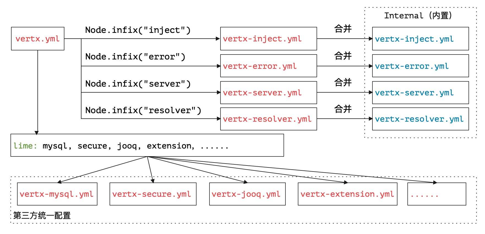
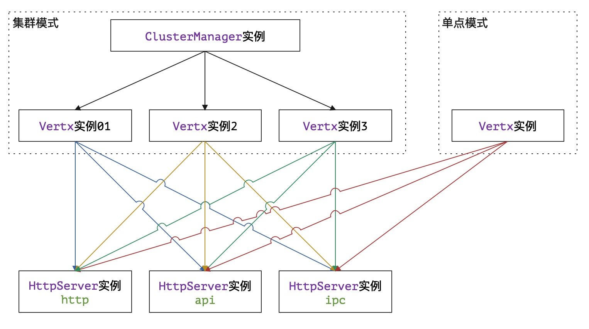
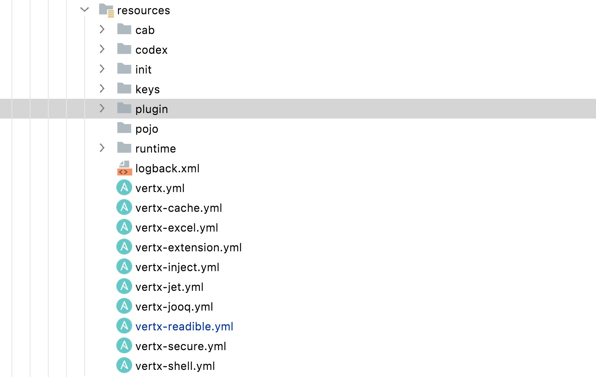

# 俯瞰：配置地图

>  俯瞰江流青一带，坐看山色碧千寻。——蔡戡《陪宪使登榕溪阁》

* 项目地址：<https://github.com/silentbalanceyh/vertx-zero-example/>（子项目：**up-native**）

&ensp;&ensp;&ensp;&ensp;本文不讲解任何和Zero Extension相关的详细配置信息，那是另外一个故事。

## 「壹」内部配置

&ensp;&ensp;&ensp;&ensp;虽然Zero框架名字叫“零”，没有任何配置也是可启动的，但往往在真实项目中要真正零配置几乎是不太可能，只是设计时如何让配置的量减到最低，又或者说让配置本身变得简单而实用且易于扩展，让开发人员压力更小，这才是目的。

&ensp;&ensp;&ensp;&ensp;Zero的基础配置规范如下：

1. 只有两种配置文件名，`.json`和`.yml`（yaml）格式。
2. 主配置从`src/main/resources`中的`vertx.yml`文件作入口。

&ensp;&ensp;&ensp;&ensp;选择`yml`文件是因为我在设计和开发Zero之前一直使用的是Spring Boot，而Zero框架的很多设计思路也是基于它而来，正因为在实际项目开发中看到了**痛点、难点**，所以一切从简，同时使得曾经用过Spring Boot的开发者可以很流畅过渡。

### 1.1. Zero配置结构

&ensp;&ensp;&ensp;&ensp;Zero预定义了基础框架的部分结构，该结构存储在`vertx-co`项目中，且它的完整结构如下图：



&ensp;&ensp;&ensp;&ensp;Zero中的核心配置主要分两部分：

* **内部配置**：内部配置在您提供了相关配置后会被合并（`内部配置 = 默认配置 + 您的配置`）。
* **Lime配置**：Lime配置主要由用户提供，提供该配置后，Zero会去扫描所有关联的节点，最终生成唯一的一份`JsonObject`——全环境统一配置。

&ensp;&ensp;&ensp;&ensp;从上述配置信息可知，除了内部配置以外，其他Lime相关配置的根节点不能出现重复（重复会覆盖），本章的任务就是带着您看看Zero中目前的Lime有些什么样的魑魅魍魉。

### 1.2. 异常配置

&ensp;&ensp;&ensp;&ensp;异常配置包含两个文件：

|文件名|Lime方式|含义|
|:---|---|:---|
|vertx-error.yml|Lime配置|错误代码异常堆栈信息定义模板，以E打头。|
|vertx-readible.yml|独立文件|直接读取，和vertx-error.yml代码绑定。|

&ensp;&ensp;&ensp;&ensp;之前讲解容错部分已经解释过这两个文件的用法，此处就不详细解释它的基本结构了，您可以将这两个文件理解成两个**哈希表**，针对某一个错误代码`code`而言：

```properties
# vertx-error.yml
# WebException定义时，该文件中的配置是必须的，如果没有则报错。
E<code>: "message, {0}, {1}, {2}"

# vertx-readible.yml
# 如果定义了该文件，那么就会在错误响应信息中追加一个业务描述节点`info`给前端使用。
<code>: "您的错误信息，xxxxx"
```

### 1.3. 插件配置

&ensp;&ensp;&ensp;&ensp;插件配置位于`vertx-inject.yml`文件中，默认插件配置只包含了日志记录器：

```properties
logger: io.vertx.up.log.internal.Log4JAnnal
```

&ensp;&ensp;&ensp;&ensp;除此，您还可以增加以下配置：

```properties
# 「Zero框架内置」
# 启用Jooq数据库访问功能，启用后才可使用 Ux.Jooq
jooq: io.vertx.tp.plugin.jooq.JooqInfix
# Cache，缓存专用，内置缓存实现，SharedMap
shared: io.vertx.tp.plugin.shared.MapInfix
# Job，任务插件，启用后台任务系统
job: io.vertx.tp.plugin.job.JobInfix

# 「Zero标准化插件」
# zero-ifx-history专用配置，启用trash回收站功能，可保存删除历史
trash: io.vertx.tp.plugin.history.TrashInfix
# zero-ifx-excel专用配置，启用Excel的导入/导出功能
excel: io.vertx.tp.plugin.excel.ExcelInfix
# zero-ifx-es专用配置，启用ElasticSearch功能
elasticsearch: io.vertx.tp.plugin.elasticsearch.ElasticSearchInfix
# zero-ifx-neo4j专用配置，启用Neo4j，图引擎数据库专用
neo4j: io.vertx.tp.plugin.neo4j.Neo4jInfix

# 「Zero和Vert.x集成插件」
# zero-ifx-redis专用配置，启用Redis
redis: io.vertx.tp.plugin.redis.RedisInfix
# zero-ifx-native专用配置，启用SQLClient
mysql: io.vertx.up.plugin.jdbc.MySqlInfix
# zero-ifx-mongo专用配置，启用MongoClient
mongo: io.vertx.tp.plugin.mongo.MongoInfix

# 「Zero扩展模块插件」
# zero-jet 动态路由专用配置，启用非Annotation模式的动态路由发布功能
router: io.vertx.tp.jet.JetPollux
```

> 如果您编写了自定义的Infix，那么上述配置中只要不重名即可。

### 1.4. Resolver配置

&ensp;&ensp;&ensp;&ensp;Resolver配置是Zero中的特殊配置，它的基础内容位于`vertx-resolver.yml`文件中，默认内容如：

```properties
default: io.vertx.up.uca.rs.mime.resolver.DefaultResolver
application:
  json: io.vertx.up.uca.rs.mime.resolver.JsonResolver
  octet-stream: io.vertx.up.uca.rs.mime.resolver.BufferResolver
  x-www-form-urlencoded: io.vertx.up.uca.rs.mime.resolver.XFormResolver
multipart:
  form-data: io.vertx.up.uca.rs.mime.resolver.FormResolver
```

&ensp;&ensp;&ensp;&ensp;上述配置在之前的文件中讲解过，按文件结构，它处理的MIME如下表格：

|MIME值|处理类|含义|
|:---|:---|:---|
|（默认）|DefaultResolver|处理不带MIME的请求。|
|application/json|JsonResolver|Json数据处理。|
|application/octet-stream|BufferResolver|二进制数据处理。|
|application/x-www-form-urlencoded|XFormResolver|多媒体表单处理。|
|multipart/form-data|FormResolver|带上传功能请求处理。|

### 1.5. 服务器配置

&ensp;&ensp;&ensp;&ensp;服务器配置位于`vertx-server.yml`文件中，默认的配置如下：

```properties
server:
# 当前服务节点名称，微服务模式下可标识节点服务器
- name: zero-ws
# 服务器类型
  type: http
# 服务器配置数据，类型不同则配置有所区别
  config:
    # 端口号
    port: 6083
    # 发布服务的Host地址，该值表示任意IP
    host: 0.0.0.0
```

&ensp;&ensp;&ensp;&ensp;注意这里支持的服务器的数量是多个，`server`节点是一个数组，而不是单个服务器，主要是为**微服务环境**量身打造的，而此处的`type`节点是读者必须要理解的节点

|type值|含义|Options|
|---|:---|:---|
|http|Http服务器，常用的RESTful容器。|HttpServerOptions|
|api|微服务模式中的Api Gateway服务。|HttpServerOptions|
|ipc|微服务模式中的Service服务，此时根据名称进行连接。|HttpServerOptions|
|sock|「保留」WebSocket专用服务。||
|rx|「保留」Rx模式下的Http服务器（类名不同。||

> 「保留」为设计了此扩展但还未实现的部分，后续版本会逐渐扩展。

### 1.6. 主配置

&ensp;&ensp;&ensp;&ensp;主配置位于`vertx.yml`文件中，默认的配置内容如：

```properties
zero:
  # 默认连接三个扩展文件
  #     vertx-error.yml
  #     vertx-inject.yml
  #     vertx-server.yml
  lime: error, inject, server
  vertx:
    # Vert.x集群服务配置
    clustered:
      # 启用 Vert.x 集群服务
      enabled: false
      # 配置 Vert.x 集群服务中的类名，为ClusterManager
      # 后期版本会使用 HA 配置代替
      manager:
      # 配置数据（根据不同的ClusterManager有所区别）
      options: 
   
    # Vert.x实例配置，为数组结构，如果是集群模式则可使用多个
    instance:
      # Vert.x实例名
    - name: vx-zero
      # Vert.x实例对应的Vert.x配置，VertxOptions类型的Json序列化结构
      options:
        # Fix block 2000 limit issue.
        maxEventLoopExecuteTime: 6000000000
```

&ensp;&ensp;&ensp;&ensp;Zero中设计的完整Vert.x部分的配置结构图如下：



&ensp;&ensp;&ensp;&ensp;整个结构包含了两个维度处理RESTful的配置：

1. 您是使用Vert.x的集群模式还是单点模式（实战可知，单点模式已经够用了）。
2. 您是使用Zero中的单机模式还是微服务模式（微服务模式下需配置ipc和api两种服务器）。

&ensp;&ensp;&ensp;&ensp;主配置的Vert.x实例的每个节点`options`对应的就是`VertxOptions`数据结构。

&ensp;&ensp;&ensp;&ensp;本章节中所有的配置都包含了**固定的文件名**，这是Zero内置的固定配置，如果您想要拓展自己的配置只能走Lime，这也是本文第一章节称为**内部配置**的原因，汇总如下：

|文件名|Lime方式|含义|
|:---|---|:---|
|vertx.yml|独立文件|主配置文件，Vertx实例专用配置。|
|vertx-inject.yml|Lime配置|插件Infix专用配置文件。|
|vertx-server.yml|Lime配置|HTTP服务器专用配置。|
|vertx-resolver.yml|独立文件|MIME解析器（可扩展）。|
|vertx-error.yml|Lime配置|异常代码表。|
|vertx-readible.yml|独立文件|业务异常信息配置。|

## 「贰」Lime配置

> lime的翻译为石灰，石灰遇水就会爆发出能量，在系统中它表示所有的插件遇到了Zero后就可发挥出它的最大能量，对所有lime配置而言，Zero就是：生命之源。

&ensp;&ensp;&ensp;&ensp;Lime配置是Zero中最灵活的配置，您可以使用一个文件来配置所有内容，也可以使用多个文件来分开配置，不论多少文件，其文件名都是按照`lime`中的定义的子文件进行汇总，假设您定义了如下片段：

```properties
vertx:
    lime: x1, x2, x3
```

&ensp;&ensp;&ensp;&ensp;那么Zero会将`vertx-x1.yml、vertx-x2.yml、vertx-x3.yml`三个文件内容合并到一起生成一个唯一的JsonObject配置，这种做法唯一的限制就是Lime针对不同功能时配置的键名必须唯一。

### 2.1. 常用规范

&ensp;&ensp;&ensp;&ensp;此处提供两套完整的文件规范（不包含主配置）。

**按功能拆分**

|文件名|含义|
|:---|:---|
|vertx-jooq.yml|Jooq主库配置、历史库配置。|
|vertx-session.yml|会话专用配置。|
|vertx-redis.yml|Redis相关配置（zero-ifx-redis)。|
|vertx-trash.yml|历史库备份功能专用配置（zero-ifx-history）。|
|vertx-es.yml|ElasticSearch专用配置（zero-ifx-es）。|
|vertx-neo4j.yml|Neo4j图库配置（zero-ifx-neo4j）。|
|vertx-cors.yml|跨域配置。|
|vertx-secure.yml|安全相关配置。|
|vertx-shell.yml|DevOps命令行专用配置（zero-ifx-shell）。|
|vertx-router.yml|动态路由启用专用配置（zero-jet）。|
|vertx-deployment.yml|Verticle部署专用配置。|
|vertx-init.yml|初始化专用配置。|
|vertx-extension.yml|Zero Extension模块核心配置。|
|vertx-job.yml|后台任务专用配置。|
|vertx-cache.yml|L1、L2、L3缓存专用配置。|
|vertx-debug.yml|调试专用配置。|
|vertx-shared.yml|SharedData专用配置。|
|vertx-sms.yml|阿里短信服务配置（zero-ifx-sms）。|
|vertx-iqiy.yml|爱奇艺视频服务配置（zero-ifx-iqiy）。|
|vertx-excel.yml|Excel导入导出专用配置（zero-ifx-excel）。|
|vertx-rpc.yml|微服务专用配置（zero-iproxy）。|
|vertx-etcd.yml|微服务ETCD专用配置。|

**最佳实践**

&ensp;&ensp;&ensp;&ensp;最佳实践主要来自于生产环境中的基础文件合并，上述文件过多，如果不做一定程度的压缩，那么对开发人员而言挺繁琐的，压缩文件符合几个基本原则：

1. 复杂配置和独立功能放到一个独立文件中以方便直接更改。
2. 常用固定配置基本只需要配置一次，修改后就不变了，放到一起。
3. 生产部署和开发不同的文件放到一起，每次部署之前统一修改，也方便DevOps脚本。

&ensp;&ensp;&ensp;&ensp;压缩过后的文件结构如：

|文件名|含义|
|:---|:---|
|vertx-excel.yml|Excel导入导出专用定义，内容比较长，独立文件。|
|vertx-cache.yml|L1、L2、L3三级缓存的基础配置（目前只支持L1，Redis）。|
|vertx-shell.yml|DevOps专用配置。|
|vertx-secure.yml|维持不变。|
|vertx-rpc.yml|微服务专用配置（zero-iproxy），原`-rpc, -etcd`|
|vertx-extention.yml|原`-init, -extension，-job, -shared, -session`配置。|
|vertx-jet.yml|原`-router, -deployment`配置。|
|vertx-jooq.yml|原`-jooq, -redis, -trash, -es, -neo4j, -cors`配置。|
|vertx-tp.yml|原`-sms, -iqiy`相关配置。|

&ensp;&ensp;&ensp;&ensp;简单说明一下：

1. `vertx-jooq.yml`是在切换环境时改动最大的一个文件，这样的结构做环境迁移几乎不需要去改动其他配置文件，仅修改`vertx-jooq.yml`即可，因为它包含了所有和Zero相关的集成部分。
2. 单点模式下`vertx-tp.yml、vertx-rpc.yml`是不用配置的文件。
3. `vertx-jet.yml`主控Verticle数量，可做简单模式下的性能调优。

&ensp;&ensp;&ensp;&ensp;所以最终形成的配置文件结构如：



&ensp;&ensp;&ensp;&ensp;截图中目录配置表如下：

|目录名|含义|
|:---|:---|
|cab|`X_MODULE`中和前端页面绑定的动态配置。|
|codex|Zero验证模块专用的接口验证配置（@Codex）。|
|keys|安全专用jceks文件目录以及其他签名文件目录。|
|plugin|Zero Extension模块专用文件目录。|
|pojo|旧系统映射层专用配置文件目录。|
|init|初始化Excel模板数据存储位置，包含所有OOB数据文件。|
|runtime|运行时的静态配置（可自由处理）。|

&ensp;&ensp;&ensp;&ensp;以上目录中除`init`和`runtime`是可自定义的，其他几个目录几乎是固定的，而且不会重复以及冲突。`init`目录中包含了系统初始化的所有配置数据，它是**产品**的第一个版本的OOB（Out-Of-Box）数据，您可以直接使用该目录的数据重置系统，等价于**恢复出厂**；`runtime`目录中包含了运行时的各种配置数据，如DevOps、动态建模临时文件、数据模板、特殊插件、测试框架Mock配置等所有和运行相关的配置文件都在此目录中。

> 接下来按功能来看看各部分的详细配置，走走这张地图。

### vertx-jooq.yml

## 「叄」小结

