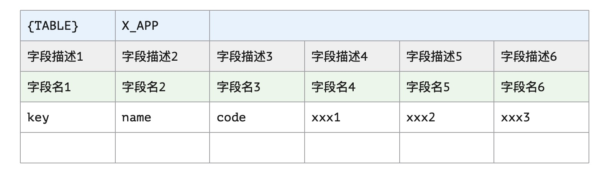
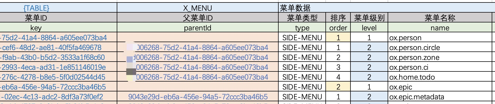

# 二向箔：Excel

>  谁能亨鱼？溉之釜鬵。谁将西归？怀之好音。——佚名 先秦《匪风》

* 项目地址：<https://github.com/silentbalanceyh/vertx-zero-example/>（子项目：**up-athena**）
* 数据文件：[data.test.xlsx](data/data.test.xlsx)

&ensp;&ensp;&ensp;&ensp;本章节讲解Zero中另外一个比较重要的插件`zero-ifx-excel`，它可以帮助您将Excel中的数据快速导入系统中，同时在上传下载过程中也可以帮您很快完成**导入导出**编程。

## 「壹」基本配置

&ensp;&ensp;&ensp;&ensp;现在您的Maven的`pom.xml`中引入下边依赖片段：

```xml
    <dependency>
        <groupId>cn.vertxup</groupId>
        <artifactId>zero-ifx-excel</artifactId>
    </dependency>
```

### 1.1. Excel模板

&ensp;&ensp;&ensp;&ensp;Zero中的一个Excel的模板格式如下：



&ensp;&ensp;&ensp;&ensp;该模板的注意事项：

1. 一个Sheet中可以包含多个`{TABLE}`的起始区域，边界计算条件如：
    * 左边界：从左往右扫描的第一个出现了`{TABLE}`的列。
    * 上边界：从上往下扫描的第一个出现了`{TABLE}`的列。
    * 右边界：`{TABLE}`行右边横跨的列总数（如上图）——一定要**合并单元格**。
    * 下边界：下边没有数据的行的上一行。
2. 一个Workbook中可以包含多个Sheet，且`{TABLE}`后一个单元格表示了当前程序应该导入到哪一张数据表中，如示例中会导入到`X_APP`表。
3. 字段描述一般为中文，提供给人阅读，而字段名不是表中的列名，而是和表绑定的Java Pojo类的属性名，例：
    
    |表名|列名|属性名（字段名）|字段描述|
    |---|---|---|---|
    |`X_APP`|NAME|name|应用名称|
    |`X_APP`|PORT|port|应用端口号|

&ensp;&ensp;&ensp;&ensp;当然若您不想使用Zero中提供的导入功能以及和Jooq绑定的数据访问功能，那就只有直接使用`ExcelInfix`结构来执行纯粹的编码模式了，Zero中的Excel使用了`Apache POI`的`4.x`版本，你可以独立开发，像前文提到过的集成插件一样，也可以直接借着本章的内容直接实现导入。一个Excel模板的示例截图如下：



> Zero中导入和导出的文件模板是一致的，只要数据准备无误，那么就可导入数据到系统。

### 1.2. Zero配置

&ensp;&ensp;&ensp;&ensp;提供了数据模板后，您需要在Zero中打开`-excel`的配置（**假设您已经完成了VertxDAO的生成流程，参考Jooq章节**）：

**vertx.yml**

```yaml
zero:
    # lime连接 vertx-excel.yml 文件
    lime: jooq, cache, excel
    vertx:
        # 省略其他部分
```

**vertx-excel.yml**

```yaml
excel:
    # 导出Excel的风格（彩色模板专用）
    pen: "io.vertx.tp.plugin.excel.tpl.BlueTpl"
    # 临时文件夹（该文件夹必须有权限写）
    temp: /tmp/
    # 映射配置，一个JsonArray结构
    mapping:
        # X_TABULAR表的导入配置
        -   table: X_TABULAR
            # Pojo类（Jooq生成）
            pojo: cn.vertxup.ambient.domain.tables.pojos.XTabular
            # Dao类（Jooq生成）
            dao: cn.vertxup.ambient.domain.tables.daos.XTabularDao
            # 主键属性名
            key: key
            # 唯一键设置，检查唯一记录依靠先主键，再唯一键
            unique:
                - code
                - type
                - appId
```

**vertx-inject.yml**

```yaml
# 省略其他部分
# Excel
excel: io.vertx.tp.plugin.excel.ExcelInfix
```

### 1.3. 导入测试

&ensp;&ensp;&ensp;&ensp;将数据文件放到您的`src/main/resources/init/`目录中：


&ensp;&ensp;&ensp;&ensp;在您的IDEA中开发启动类：

```java
package cn.vertxup;

import io.vertx.tp.ke.booter.Bt;

public class AthenaLoader {
    public static void main(final String[] args) {
        Bt.doImports("init");
    }
}
```

&ensp;&ensp;&ensp;&ensp;创建对应的运行配置


## 「贰」开发场景


