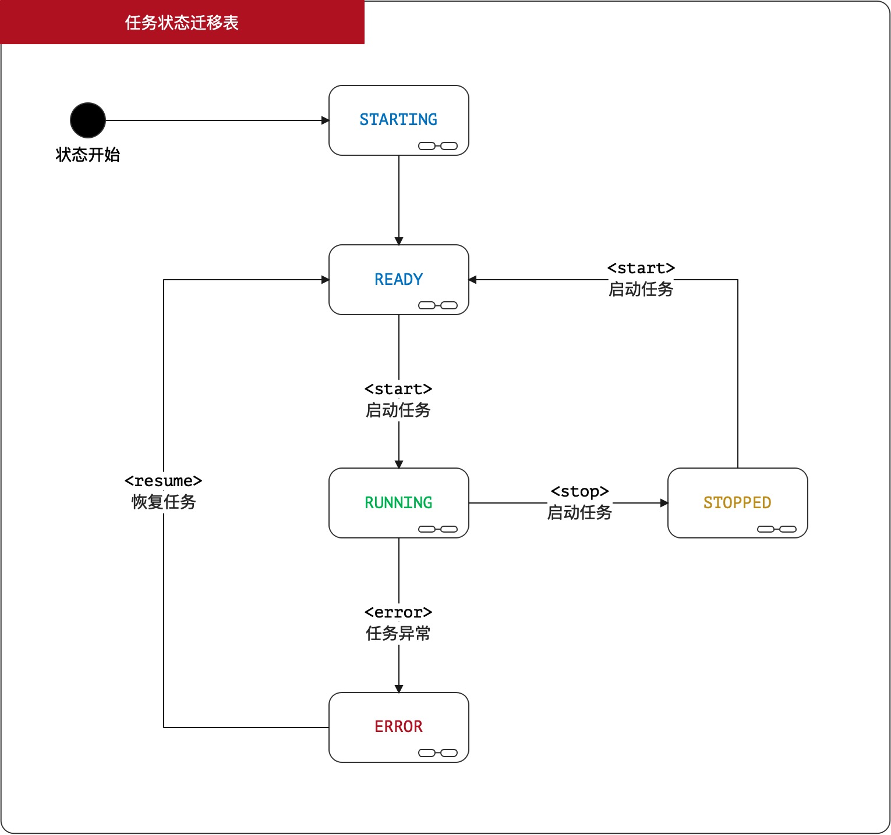
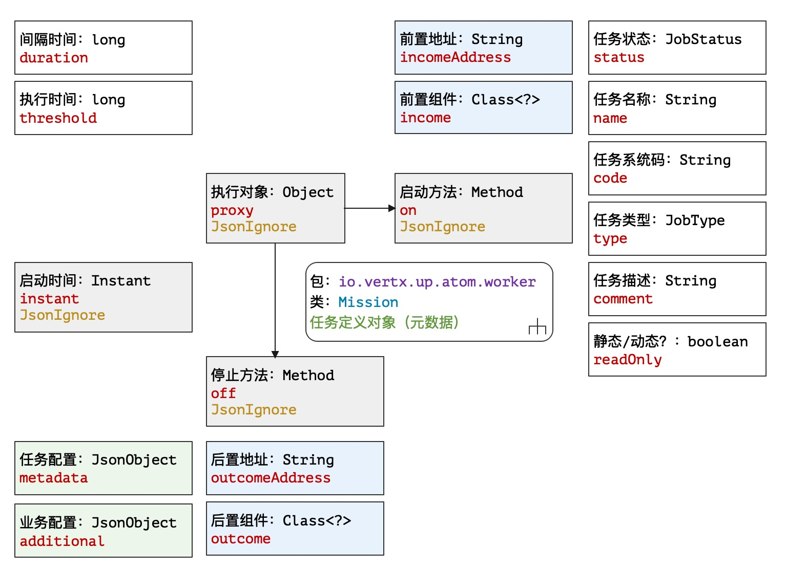
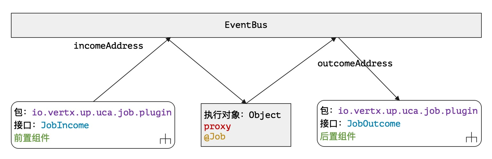

# 隐匿者：Job

> 烟霞壁立水溶溶，路转崖回旦暮中。鸂鶒畏人沈涧月，山羊投石挂岩松。——唐 薛逢《五峰隐者》

* 项目地址：<https://github.com/silentbalanceyh/vertx-zero-example/>（子项目：**up-ares**）

&ensp;&ensp;&ensp;&ensp;本章回到Zero中一个重要功能：**后台任务**，由于任务模块在很多场景中都实用，所以Zero将该模块直接设计到了框架内部，有了该模块您就可以在容器启动时执行某些系统专用的后台任务。

> 我们在生产环境设置了超过400多个Job，目前用该架构运行是可靠并且稳定的。

## 「壹」基础知识

&ensp;&ensp;&ensp;&ensp;后台任务在Zero中使用了额外设计，主要原因是Vert.x的3.9.x的版本中并没有提供专用的任务子模块，于是在项目中使用Vert.x中提供的Timer实现了任务的完整流程，在重新设计后提供给开发者让您也可以很方便在Zero中开发想要的后台任务组件。

### 1.1. 任务配置

&ensp;&ensp;&ensp;&ensp;先在环境中打开任务配置：

**vertx.yml**

```yaml
zero:
    # lime 连接vertx-job.yml配置文件
    lime: job
```

**vertx-job.yml**

```yaml
job:
    store:
        # 任务存储器
        component: io.vertx.tp.jet.uca.micro.JtHypnos
```

&ensp;&ensp;&ensp;&ensp;回顾任务部分的配置图如下：


&ensp;&ensp;&ensp;&ensp;整个任务组件按职责分为三种：

|组件名|配置节点|含义|
|---|---|:---|
|任务存储器|store|存储任务定义数据的专用组件。|
|任务调度器|interval|提供可扩展的调度、管理组件对任务进行控制。|
|任务客户端|client|客户端组件，可发送启动、停止、恢复等命令。|

### 1.2. 状态迁移图

> 定义在文件`io.vertx.up.eon.em.JobStatus`中。

&ensp;&ensp;&ensp;&ensp;Zero中的任务状态迁移图如下：



&ensp;&ensp;&ensp;&ensp;状态说明：

|状态|名称|含义|
|---|---|:---|
|STARTING|启动中|任务正在执行启动并执行配置初始化（异步）。|
|READY|就绪|该任务处于就绪状态，等待执行。|
|RUNNING|运行中|该任务正在运行中，长时间任务可能一直处于该状态。|
|ERROR|异常|任务执行过程中遇到了不可预知的错误导致任务异常终止。|
|STOPPED|停止|该任务执行完成，正常停止。|

### 1.3. 任务分类

> 定义在文件`io.vertx.up.eon.em.JobType`中。

&ensp;&ensp;&ensp;&ensp;Zero中把任务种类分成了四种（其中一种保留）：

|任务名|值|含义|
|:---|---|:---|
|一次任务|ONCE|触发式，执行完后直接停止等待下一次触发命令。|
|计划任务|PLAN|计划式，Zero启动时开始执行，每隔一段时间轮询执行。|
|定时任务|FIXED|计划式，可设置固定启动时间戳，同PLAN。|
|任务集|CONTAINER|「保留」任务编排器，可对更多子任务进行调度。|

&ensp;&ensp;&ensp;&ensp;如果您是使用@Job开发任务，那么只支持ONCE和PLAN两种，若使用`zero-jet`项目中的**动态路由**和**动态任务**功能，就直接支持FIXED任务了，目前有一种解决方案就是在Income组件中对Mission对象进行修正。

### 1.4 启动组件

&ensp;&ensp;&ensp;&ensp;Zero中的任务启动器是`io.vertx.up.verticle.ZeroScheduler`类，它的定义如下：

```java
/**
 * Background worker of Zero framework, 
 * it's for schedule of background tasks here.
 * This scheduler is for task deployment, it should deploy all tasks
 * This worker must be SINGLE ( instances = 1 ) 
 * because multi worker with the same tasks may be
 * conflicts
 */
@Worker(instances = Values.SINGLE)
public class ZeroScheduler extends AbstractVerticle
```

&ensp;&ensp;&ensp;&ensp;此处使用了@Worker（`io.vertx.up.annotations.Worker`）注解，且它的instances的值为`1`，为什么该启动组件的实例只有1个？它的职责是在Vertx实例启动时直接发布所有目前系统中定义的任务，并连接各自不同的任务调度器，由于它的类型是一个Verticle组件，如果有多个实例，对于定时任务这种后台执行时会出现多任务抢资源的情况，所以从某种意义上讲，一种类型的后台任务只维持一个（这个只能在实战中逐渐体会）。所以ZeroScheduler是一个**任务发布器**，它不负责任务调度，只负责在Zero容器启动时发布定义的任务，它只会在启动时运行一次。

### 1.5. @Job

&ensp;&ensp;&ensp;&ensp;Zero中定义任务使用任务注解`io.vertx.up.annotations.Job`，该任务注解可配置的方法表如下：

|方法名|类型|含义|
|:---|---|:---|
|value()|JobType|描述被注解的类的任务类型。|
|name()|String|该任务的名称，如果不提供则Zero会为您自动生成任务名。|
|config()|String|提供一个资源文件路径，可设置复杂任务的相关配置。|
|duration()|long|计划任务的时间间隔，默认：300。|
|durationUnit|TimeUnit|时间间隔单位，默认：秒。|
|threshold()|long|任务运行时长，影响Worker的block时间，默认：900|
|thresholdUnit()|TimeUnit|时长单位，默认：秒。|

&ensp;&ensp;&ensp;&ensp;有一点需说明即定时任务中的开始时间只能依赖`config()`来实现复杂配置，即您可以在一个静态配置文件中将该任务部署到环境里（每个任务一个），如此您就可以直接编写您的任务逻辑，而不需要去考虑**任务调度**了。

### 1.6. Mission

&ensp;&ensp;&ensp;&ensp;任务的核心数据对象就是`io.vertx.up.atom.worker.Mission`，您在编写任务组件时，必须对该对象有详细了解，它将**注解式**和**配置式**的两种存储源统一到一起，不论你使用哪种任务存储器，最终ZeroScheduler拿到的任务定义数据类型是`Set<Mission>`；本章节不牵涉Zero Extention模块，所以不深入`zero-jet`中存在的基于数据表的任务存储器，只讨论注解模式下纯开发的部分。

&ensp;&ensp;&ensp;&ensp;该对象的核心结构参考下图（**属性分布图**）：



&ensp;&ensp;&ensp;&ensp;需说明的一点是`readOnly`属性，该属性是根据定义计算出来的属性，它表示的并不是运行时的Mission不可变更，而表示的是**任务存储器**中的**元数据**不可变更，目前从实战中可知：

1. 使用@Job注解模式开发的任务为静态任务，readOnly = true。
2. 使用`zero-jet`开发的任务为动态任务，readOnly = false（可随时更改）。

### 1.7. Income/Outcome

&ensp;&ensp;&ensp;&ensp;Zero任务系统中包含两个特殊组件`Income/Outcome`，一个组件在任务之前执行，另外一个组件在任务之后执行，它们之间通过EventBus互通数据，整体执行步骤如：



&ensp;&ensp;&ensp;&ensp;三个组件交互数据时使用的就是统一数据模型`Envelop`。

## 「贰」实战分析

### 2.1. 任务初探

### 2.2. 一次任务

### 2.3. 计划/定时任务

### 2.4. 任务客户端

## 「叁」小结


